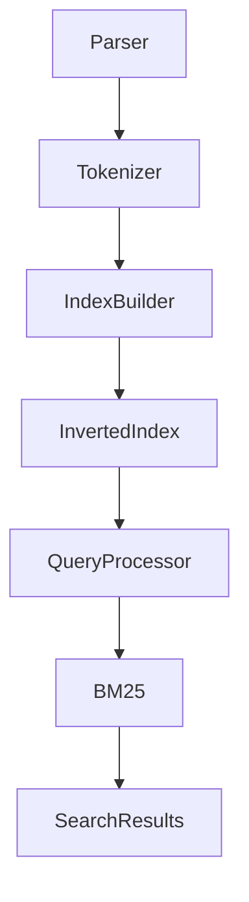

# 01. Inverted Index Architecture

**Project:** TROVIX  
**Module:** Search Engine Core  
**Version:** 1.0  
**Author:** Pari (Indexing Lead)

---

## Introduction

TROVIX is a production-inspired search engine built from scratch to understand the internal architecture of modern information retrieval systems.

Unlike search engines built using existing frameworks such as Elasticsearch or Apache Solr, TROVIX implements every major component manually. This approach provides a deeper understanding of how documents are indexed, searched, ranked, and retrieved efficiently.

This document defines the overall architecture of the indexing subsystem and serves as the design blueprint before implementation begins.

---

## Problem Statement

Searching documents by sequentially scanning every file is computationally expensive.

For example, if a collection contains 100,000 documents and a user searches for:

```
machine learning
```

a naïve search algorithm would inspect every document individually.

```
Query
  │
  ▼
Document 1
Document 2
Document 3
...
Document 100000
```

The time required increases linearly with the number of documents, making this approach unsuitable for large-scale search systems.

The objective of TROVIX is to eliminate this bottleneck by designing an indexing system that allows relevant documents to be located in milliseconds.

...
---

# Why an Inverted Index?

Before designing the indexing subsystem, it is important to understand why an inverted index exists in the first place.

Every search engine has one primary objective:

> Given a user's query, retrieve the most relevant documents as quickly as possible.

For a small collection of documents, it is technically possible to search every document individually whenever a query arrives. However, as the number of documents grows, this approach quickly becomes computationally infeasible.

Imagine a collection containing:

- 50,000 articles
- 500,000 webpages
- 10 million product descriptions

Now consider a user searching for:

```
wireless bluetooth headphones
```

Without an index, the search engine would need to:

1. Open every document.
2. Read its contents.
3. Search for every query term.
4. Compute a relevance score.
5. Repeat for every document.

The larger the dataset becomes, the slower every query becomes.

Instead, search engines perform the expensive work **before** users search.

This preprocessing step is known as **indexing**.

During indexing, every document is analyzed once and transformed into a structure that allows extremely fast lookup later.

The result is the Inverted Index.

---

# Background

## What is Information Retrieval?

Information Retrieval (IR) is the field of computer science concerned with storing, organizing, and retrieving information efficiently.

Unlike traditional databases, Information Retrieval systems are optimized for searching large collections of unstructured text.

Examples include:

- Google Search
- Bing
- Elasticsearch
- Apache Solr
- GitHub Search
- Amazon Product Search

Although these systems differ in scale and implementation, they all share the same fundamental workflow:

```
Documents

↓

Index Documents

↓

Store Searchable Index

↓

Receive Query

↓

Retrieve Candidate Documents

↓

Rank Results

↓

Return Results
```

TROVIX follows the same high-level architecture.

---

# Forward Index vs Inverted Index

Understanding the difference between these two data structures explains why search engines use inverted indexes.

## Forward Index

A Forward Index stores each document together with the words contained inside it.

Example

```
Document 1

Machine
Learning
Python
AI

-----------------------

Document 2

Deep
Learning
Neural
Networks

-----------------------

Document 3

Machine
Vision
Camera
```

Searching for the word **Machine** requires opening every document until matches are found.

The search engine cannot directly answer:

> Which documents contain "Machine"?

It must inspect every document individually.

Time Complexity

```
O(Number of Documents)
```

This becomes inefficient as the corpus grows.

---

## Inverted Index

An Inverted Index reverses this relationship.

Instead of storing:

```
Document

↓

Words
```

it stores

```
Word

↓

Documents
```

Example

```
Machine

↓

Document 1
Document 3

-------------------

Learning

↓

Document 1
Document 2

-------------------

Python

↓

Document 1
```

Now the answer already exists inside the index.

Searching for "Machine" simply becomes

```
Lookup

↓

Machine

↓

Posting List

↓

Document 1
Document 3
```

No document scanning is required.

---

# Why This Architecture?

The inverted index offers several important advantages.

## Extremely Fast Lookup

Finding all documents containing a term becomes a dictionary lookup instead of a full scan.

---

## Reduced Computation

The expensive text processing is performed only once during indexing.

Queries reuse the existing index.

---

## Efficient Ranking

Since only matching documents are retrieved, ranking algorithms such as BM25 only score candidate documents rather than the entire corpus.

---

## Scalability

As more documents are added, query latency remains low because retrieval depends primarily on posting list size instead of total corpus size.

---

## Separation of Responsibilities

The search engine naturally separates into two independent systems:

```
Indexing System

↓

Creates Index

=====================

Search System

↓

Uses Existing Index
```

This separation makes the architecture modular and easier to maintain.

---

# Design Philosophy

TROVIX is designed around several engineering principles.

## Modularity

Each component has one responsibility.

Examples include:

- Document Parsing
- Tokenization
- Index Construction
- Ranking
- Query Processing

Each module can evolve independently.

---

## Scalability

The indexing system should continue working efficiently as the document collection grows from thousands to millions of documents.

Future improvements should not require redesigning the core architecture.

---

## Maintainability

Components communicate through clearly defined interfaces.

This allows developers to modify or replace one module without affecting the rest of the system.

---

## Extensibility

The architecture is intentionally designed so that additional features can be integrated later.

Examples include:

- Phrase Search
- Positional Indexes
- PageRank
- Query Expansion
- Distributed Indexing
- Hybrid Vector Search

The initial implementation should not prevent future enhancements.

---

## Performance First

Every architectural decision is made with query latency in mind.

The guiding principle is:

> Spend more time building the index so that searching becomes significantly faster.
---

# Overall System Architecture

TROVIX is designed as a modular search engine where each subsystem performs one well-defined responsibility.

Rather than combining indexing, ranking, and querying into a single monolithic application, the system separates them into independent components.

This architecture provides several advantages:

- Easier debugging
- Independent development
- Better testing
- Improved scalability
- Future extensibility

Every component communicates through well-defined interfaces, allowing implementations to change without affecting the rest of the system.

---

# High-Level Architecture


The architecture consists of two completely independent workflows:

1. Indexing Pipeline
2. Query Pipeline

The indexing pipeline runs only when documents are added or updated.

The query pipeline executes every time a user performs a search.

Keeping these workflows independent significantly improves search performance because expensive preprocessing is completed before any user queries arrive.

---

# System Modules

The TROVIX indexing subsystem consists of the following modules.

| Module | Responsibility |
|---------|----------------|
| Document Parser | Reads raw documents and extracts text |
| Tokenization Pipeline | Cleans and normalizes text |
| Index Builder | Constructs the inverted index |
| Inverted Index | Stores searchable vocabulary |
| Query Processor | Handles incoming search requests |
| BM25 Engine | Computes relevance scores |
| Search Engine | Returns ranked search results |

Each module is implemented independently.

This separation follows the **Single Responsibility Principle**, ensuring that every component has one clearly defined task.

---

# Indexing Pipeline

The indexing pipeline transforms raw documents into a searchable index.

Unlike query processing, indexing is performed offline.

A document passes through several stages before becoming searchable.


The output of this pipeline is a fully constructed inverted index that can later be queried efficiently.

---

## Stage 1 — Document Parsing

The parser reads documents from disk.

Responsibilities include:

- Reading files
- Assigning document IDs
- Extracting textual content
- Ignoring unsupported formats
- Preparing structured Document objects

Output:

```python
Document(
    id=1,
    title="Introduction to Search Engines",
    body="..."
)
```

---

## Stage 2 — Tokenization

The tokenizer converts free-form text into normalized search terms.

Processing steps include:

- Lowercasing
- Unicode normalization
- Removing punctuation
- Splitting into tokens
- Stopword removal
- Stemming

Example

Input

```
The Search Engines are Running Efficiently.
```

Output

```
search
engin
run
effici
```

---

## Stage 3 — Index Building

The Index Builder receives normalized tokens and constructs the inverted index.

For every token it performs:

- Vocabulary lookup
- Document frequency updates
- Term frequency counting
- Posting list creation

The resulting structure is stored in memory and later persisted.

---

# Query Pipeline

Unlike indexing, the query pipeline executes for every user request.

Its primary objective is to return relevant documents as quickly as possible.


Notice that the query pipeline never scans documents directly.

Instead, it searches the inverted index created during indexing.

This is the primary reason search remains fast even for large document collections.

---

# Component Interaction

The following diagram illustrates how different modules depend on each other.



Each component has a single responsibility.

For example:

- The parser knows nothing about BM25.
- BM25 knows nothing about parsing.
- The tokenizer is reused during indexing and querying.
- The index builder never ranks documents.

This separation improves maintainability and allows components to evolve independently.

---

# Folder Organization

The architecture maps directly to the project structure.

```
src/

├── parser/
│   └── document_parser.py
│
├── tokenizer/
│   ├── tokenizer.py
│   ├── stopwords.py
│   └── stemmer.py
│
├── index/
│   ├── posting.py
│   ├── inverted_index.py
│   ├── vocabulary.py
│   └── index_builder.py
│
├── ranking/
│   └── bm25.py
│
├── search/
│   ├── query_parser.py
│   └── search_engine.py
│
└── models/
    └── document.py
```

The codebase is organized so that every folder corresponds to one architectural component described in this document.

Future contributors should be able to navigate the repository by following the architecture diagrams above.

---

# Core Data Structures

The efficiency of TROVIX depends heavily on the choice of data structures.

An efficient search engine is not simply the result of a good ranking algorithm; it is primarily the result of organizing data so that retrieval operations require minimal computation.

The indexing subsystem revolves around six primary data structures:

1. Document
2. Token
3. Posting
4. Posting List
5. Vocabulary
6. Inverted Index

Each structure is designed with a single responsibility and optimized for fast lookup during query execution.

---

# 1. Document

A **Document** represents the smallest searchable unit within TROVIX.

Every file that enters the indexing pipeline is converted into a Document object before any processing begins.

The parser is responsible for constructing this object.

## Structure

```python
class Document:
    id: int
    title: str
    body: str
```

## Responsibilities

A Document stores:

- Unique document identifier
- Title
- Raw textual content

Future versions may also include:

```python
class Document:
    id: int
    url: str
    title: str
    body: str
    author: str
    language: str
    timestamp: datetime
    metadata: dict
```

---

## Why separate Documents from the Index?

Documents remain immutable after parsing.

The index should never duplicate document contents.

Instead, it stores references (Document IDs).

This minimizes memory consumption.

Instead of storing

```
Machine Learning Article

Machine Learning Article

Machine Learning Article
```

multiple times,

the index stores

```
Document ID = 17
```

which occupies significantly less memory.

---

# 2. Token

A token is the smallest searchable unit generated by the tokenizer.

Example

Raw text

```
Machine Learning is Amazing.
```

↓

Tokens

```
machine
learn
amaz
```

Each token represents a normalized version of a word.

Normalization ensures that

```
Machine
machine
MACHINE
```

all map to the same vocabulary entry.

---

## Why Normalize?

Without normalization,

```
Machine
machine
machines
MACHINE
```

would produce four separate entries.

Normalization reduces vocabulary size while improving retrieval accuracy.

---

# 3. Posting

A Posting represents the occurrence of one term inside one document.

Think of it as a relationship.

```
(machine)

↓

(Document 17)
```

A posting stores information needed during ranking.

## Initial Structure

```python
class Posting:
    document_id: int
    term_frequency: int
```

Example

```python
Posting(
    document_id=17,
    term_frequency=5
)
```

This indicates

- Document 17 contains the term
- It appears five times

---

## Future Posting Structure

As TROVIX evolves, additional information can be stored.

```python
class Posting:
    document_id: int
    term_frequency: int
    positions: list[int]
    field: str
```

Positions enable:

- Phrase Search
- Proximity Search
- Snippet Generation

---

# 4. Posting List

A Posting List is a collection of postings associated with a single term.

Example

```
machine

↓

Document 1
Document 4
Document 17
Document 28
```

Representation

```python
[
    Posting(1,4),
    Posting(4,2),
    Posting(17,1),
    Posting(28,6)
]
```

Every unique word inside the vocabulary owns exactly one posting list.

---

## Why Posting Lists?

Suppose a user searches

```
machine
```

Instead of opening every document,

the search engine immediately retrieves

```
Posting List(machine)
```

This operation is extremely fast.

---

# 5. Vocabulary

The vocabulary contains every unique token present in the corpus.

Example

```
machine
learning
python
database
cloud
docker
```

Each word points directly to its posting list.

Representation

```python
{
    "machine": PostingList,
    "learning": PostingList,
    "python": PostingList
}
```

The vocabulary acts as the entry point into the inverted index.

---

## Why Use a Dictionary?

Python dictionaries provide average-case constant-time lookup.

```
Vocabulary["machine"]
```

is approximately

```
O(1)
```

This allows query processing to remain extremely fast.

---

# 6. Inverted Index

The Inverted Index combines the vocabulary and posting lists into a single searchable structure.

Conceptually,

```
Word

↓

Posting List

↓

Posting

↓

Document
```

Example

```python
{
    "machine": [
        Posting(1,3),
        Posting(8,2),
        Posting(15,6)
    ],

    "learning": [
        Posting(1,4),
        Posting(7,1),
        Posting(15,2)
    ]
}
```

This structure is the heart of TROVIX.

Every search query ultimately interacts with the inverted index.

---

# Additional Statistics

Ranking algorithms require more than posting lists.

The index must also maintain corpus statistics.

These include:

## Document Length

```
Document 1

↓

327 words
```

Stored as

```python
document_lengths = {
    1:327,
    2:814,
    3:156
}
```

---

## Average Document Length

BM25 requires the average length of all indexed documents.

```
Average Length

↓

412.8 words
```

---

## Document Frequency

Number of documents containing a term.

Example

```
machine

↓

85 documents
```

This value is used when computing IDF.

---

## Total Documents

The corpus size.

Example

```
N = 52,814 documents
```

Almost every ranking formula requires this statistic.

---

# Relationship Between Structures

```text
Corpus

↓

Documents

↓

Tokens

↓

Vocabulary

↓

Posting Lists

↓

Postings

↓

Document IDs
```

Each level builds upon the previous one.

Removing or redesigning one structure affects every subsequent stage of the indexing pipeline.

---

# Design Decisions

| Decision | Reason |
|----------|--------|
| Integer Document IDs | Lower memory usage than storing filenames |
| Dictionary Vocabulary | O(1) average lookup |
| Separate Posting Lists | Faster retrieval and easier updates |
| Store Term Frequency | Required for BM25 scoring |
| Keep Documents Separate | Avoid data duplication |

---

# Summary

The data structures defined in this section form the foundation of TROVIX's indexing engine.

Every subsequent module—including the tokenizer, index builder, BM25 implementation, and query processor—operates on these structures. Choosing efficient representations at this stage is essential for achieving fast query execution, low memory overhead, and a modular architecture that can support future features such as positional indexing, phrase search, and distributed retrieval.

---

# Indexing Workflow

The indexing workflow describes how a document is transformed from raw text into a searchable representation inside the inverted index.

Unlike query processing, indexing is an **offline operation**. Since it is performed before users search, the system can spend more time preprocessing documents in exchange for significantly faster search performance later.

The workflow consists of six sequential stages.


Each stage receives the output of the previous stage and transforms it into a more structured representation.

---

# Step 1 — Read the Document

The indexing process begins by reading a document from disk.

Example

```
article.txt

Machine Learning is changing modern software development.
```

At this point the search engine has no understanding of the document.

It only knows that a file exists.

The responsibility of converting this file into a structured object belongs to the **Document Parser**.

Output

```python
Document(
    id=1,
    title="article.txt",
    body="Machine Learning is changing modern software development."
)
```

---

# Step 2 — Parse the Document

The parser extracts useful information from the raw file.

Responsibilities include:

- Reading file contents
- Extracting textual content
- Assigning a unique document ID
- Ignoring unsupported files
- Returning a standardized Document object

At this stage no indexing has occurred.

The parser simply prepares data for later stages.

---

# Step 3 — Tokenization

The tokenizer converts free-form text into normalized search terms.

Suppose the document contains

```
Machine Learning is changing modern software development.
```

### Lowercase

```
machine learning is changing modern software development.
```

↓

### Remove punctuation

```
machine learning is changing modern software development
```

↓

### Split into words

```
machine

learning

is

changing

modern

software

development
```

↓

### Remove stopwords

```
machine

learning

changing

modern

software

development
```

↓

### Stem words

```
machin

learn

chang

modern

softwar

develop
```

These normalized tokens are forwarded to the Index Builder.

---

# Step 4 — Count Term Frequencies

The Index Builder first determines how many times every token appears inside the document.

Example

```
Document

Machine
Learning
Machine
Python
Learning
Machine
```

Frequency Table

| Term | Frequency |
|------|-----------|
| machine | 3 |
| learning | 2 |
| python | 1 |

This information becomes the Term Frequency (TF) component required later by BM25.

---

# Step 5 — Update Posting Lists

For every unique token, the corresponding posting list is updated.

Suppose the current document has

```
Document ID = 17
```

The token

```
machine
```

produces

```python
Posting(
    document_id=17,
    term_frequency=3
)
```

This posting is appended to

```
PostingList(machine)
```

Example

Before

```python
machine

↓

[
    Posting(1,2),
    Posting(5,1)
]
```

After

```python
machine

↓

[
    Posting(1,2),
    Posting(5,1),
    Posting(17,3)
]
```

The same process repeats for every unique token.

---

# Step 6 — Update Vocabulary

Whenever a new token is encountered, it is inserted into the vocabulary.

Example

Before

```python
Vocabulary

↓

machine
learning
python
```

New token

```
database
```

After

```python
Vocabulary

↓

machine
learning
python
database
```

If the token already exists, its posting list is updated instead.

---

# Step 7 — Update Corpus Statistics

Once indexing of a document is complete, several statistics are recorded.

These statistics are required by BM25.

## Document Length

```
Document 17

↓

238 words
```

Stored as

```python
document_lengths[17] = 238
```

---

## Total Documents

```
N += 1
```

---

## Average Document Length

Updated after indexing completes.

```
Average Length

↓

254.7 words
```

---

## Document Frequency

For every unique term

```
machine

↓

86 documents
```

Document Frequency increases by one.

---

# Final Index Structure

After all documents have been processed, the index resembles the following structure.

```text
Vocabulary
│
├── machine
│      │
│      ▼
│   Posting List
│      │
│      ├── Doc 1 (TF=4)
│      ├── Doc 8 (TF=2)
│      └── Doc 17 (TF=3)
│
├── learning
│      │
│      ▼
│   Posting List
│
└── python
       │
       ▼
   Posting List
```

Notice that the documents themselves are **not** stored inside the index.

Only references to documents are maintained.

This keeps the index compact and efficient.

---

# Why Build the Index Offline?

Index construction is intentionally separated from query execution.

Advantages include:

- Users never wait for indexing.
- Expensive preprocessing occurs only once.
- Search latency remains consistently low.
- Ranking algorithms receive precomputed statistics.
- The search engine scales more effectively.

This design follows the same philosophy used by modern search systems such as Lucene and Elasticsearch.

---

# Key Takeaways

By the end of the indexing workflow:

- Every document has a unique identifier.
- Every word has been normalized.
- Every unique term has an associated posting list.
- Corpus statistics have been computed.
- The inverted index is ready to answer search queries efficiently.

The next stage of the architecture focuses on how this completed index is used to process user queries and rank documents using BM25.

---

# Design Decisions

Every major architectural decision in TROVIX has been made by evaluating multiple alternatives and selecting the approach that best balances performance, maintainability, and simplicity.

This section documents the reasoning behind these choices.

---

# Decision 1: Why an Inverted Index?

## Problem

There are two common approaches to keyword search:

1. Sequentially scan every document.
2. Build an index beforehand.

## Alternatives Considered

### Option A — Sequential Scan

```
User Query

↓

Open every document

↓

Search contents

↓

Return matches
```

Advantages

- Extremely simple
- No preprocessing required

Disadvantages

- Very slow
- Query time increases linearly with corpus size
- Does not scale

Complexity

```
O(Number of Documents)
```

---

### Option B — Inverted Index ✅

```
Word

↓

Posting List

↓

Matching Documents
```

Advantages

- Extremely fast lookup
- Scales efficiently
- Enables ranking algorithms
- Industry standard

Disadvantages

- Additional preprocessing
- Higher memory consumption

Decision

The inverted index was selected because search performance is significantly more important than indexing time.

Users search many more times than documents are indexed.

---

# Decision 2: Why Offline Indexing?

Instead of building the index every time someone searches, TROVIX performs indexing before queries arrive.

```
Documents

↓

Build Index

↓

Store Index

↓

Serve Queries
```

Advantages

- Faster searches
- No repeated preprocessing
- Better scalability
- Consistent latency

Trade-off

Indexing takes longer initially.

However, this cost is paid only once.

Decision

Offline indexing is the standard architecture used by most modern search engines and is therefore adopted by TROVIX.

---

# Decision 3: Why Use Integer Document IDs?

Each document is assigned an integer identifier.

Example

```
17
```

instead of

```
research_paper_machine_learning.pdf
```

Advantages

- Smaller memory footprint
- Faster comparisons
- Faster lookups
- Easier serialization

Decision

Document IDs remain immutable throughout the lifetime of the index.

---

# Decision 4: Why Store Posting Lists?

Instead of storing complete documents for every word,

```
machine

↓

Entire Document
```

TROVIX stores

```
machine

↓

Posting List

↓

Document IDs
```

Advantages

- Eliminates duplicate storage
- Lower memory usage
- Faster retrieval

Only references are stored inside the index.

---

# Decision 5: Why Normalize Text?

Without normalization,

```
Machine

machine

MACHINE

Machines
```

would produce four separate entries.

Normalization converts them into

```
machin
```

Advantages

- Smaller vocabulary
- Better retrieval accuracy
- Consistent indexing

Decision

Every document and every query passes through the exact same tokenization pipeline.

This guarantees consistent behavior.

---

# Decision 6: Why Reuse the Tokenizer?

The tokenizer is shared between indexing and querying.

```
Document

↓

Tokenizer

↓

Index


User Query

↓

Tokenizer

↓

Search
```

Advantages

- Consistent preprocessing
- Easier maintenance
- Reduced code duplication

Decision

A single tokenizer implementation will be used throughout TROVIX.

---

# Decision 7: Why BM25 Instead of Simple Keyword Matching?

Simple keyword matching treats every occurrence equally.

Example

```
machine

↓

Found
```

No notion of relevance exists.

BM25 considers

- Term Frequency
- Document Frequency
- Document Length

This allows the engine to rank documents intelligently.

Decision

BM25 will serve as the default ranking algorithm.

Future ranking algorithms can be integrated without modifying the indexing subsystem.

---

# Decision 8: Why a Modular Architecture?

Rather than placing all functionality inside one file,

```
search.py
```

TROVIX separates responsibilities.

```
parser/

tokenizer/

index/

ranking/

search/
```

Advantages

- Easier debugging
- Better testing
- Independent development
- Cleaner codebase

Decision

Every module has exactly one primary responsibility.

This follows the Single Responsibility Principle.

---

# Decision 9: Why Python Dictionaries?

Vocabulary lookup is one of the most common operations during search.

Python dictionaries provide approximately

```
O(1)
```

average lookup.

Alternative structures considered

- Trie
- Balanced Tree
- Linked List

Although tries are useful for autocomplete, they introduce unnecessary complexity for the first version.

Decision

Python dictionaries provide the best balance between simplicity and performance.

---

# Summary of Design Decisions

| Decision | Selected Approach | Reason |
|----------|-------------------|--------|
| Search Structure | Inverted Index | Fast retrieval |
| Indexing | Offline | Lower query latency |
| Document IDs | Integer | Memory efficiency |
| Storage | Posting Lists | Avoid duplication |
| Text Processing | Normalization | Consistent indexing |
| Ranking | BM25 | Better relevance |
| Vocabulary | Python Dictionary | O(1) lookup |
| Architecture | Modular | Maintainability |

These design decisions establish the architectural foundation of TROVIX and will guide the implementation of every component throughout the project.

---

# Architectural Trade-offs

No architecture is perfect.

Every design decision made while building TROVIX involves balancing competing priorities such as speed, memory consumption, implementation complexity, and scalability.

Understanding these trade-offs is essential because improving one aspect of the system often comes at the cost of another.

This section discusses the major trade-offs made while designing the indexing subsystem.

---

# 1. Indexing Time vs Query Time

One of the biggest architectural decisions in any search engine is deciding **when** to perform the expensive work.

There are two possible approaches.

## Option A — Compute During Search

```
User Query

↓

Read Documents

↓

Tokenize

↓

Calculate Frequencies

↓

Return Results
```

Advantages

- No preprocessing required.
- New documents are immediately searchable.

Disadvantages

- Every query repeats the same expensive computations.
- Query latency increases significantly.
- Does not scale well.

---

## Option B — Compute During Indexing (Chosen)

```
Documents

↓

Build Index

↓

Store Index

↓

User Searches

↓

Instant Lookup
```

Advantages

- Extremely fast searches.
- Expensive work happens only once.
- Better user experience.

Disadvantages

- Initial indexing takes longer.
- Index must be rebuilt or updated when documents change.

**Decision**

TROVIX prioritizes fast search performance over indexing speed.

Since documents are indexed far less frequently than they are searched, this provides the greatest overall benefit.

---

# 2. Memory Usage vs Search Speed

The inverted index consumes additional memory because it stores metadata alongside the documents.

Example

Instead of only storing documents,

```
Document
```

the system also stores

- Vocabulary
- Posting Lists
- Document Statistics
- Term Frequencies

This increases memory usage.

However, queries become dramatically faster because documents no longer need to be scanned.

**Trade-off**

Higher memory consumption in exchange for significantly lower query latency.

---

# 3. Simplicity vs Rich Features

The first version of TROVIX intentionally focuses on lexical search.

Features intentionally excluded include:

- Phrase Search
- Wildcard Search
- Autocomplete
- Synonym Expansion
- Semantic Search
- Learning-to-Rank

Adding these features early would increase implementation complexity and make debugging more difficult.

Instead, the project establishes a strong foundation before introducing advanced retrieval techniques.

---

# 4. Stemming vs Lemmatization

Both techniques normalize words.

## Stemming

Example

```
running

↓

run
```

Advantages

- Fast
- Lightweight
- Easy to implement

Disadvantages

- Can produce non-dictionary words.
- Lower linguistic accuracy.

---

## Lemmatization

Example

```
running

↓

run
```

Advantages

- More accurate.
- Preserves linguistic meaning.

Disadvantages

- Requires additional language models.
- Computationally slower.

**Decision**

TROVIX uses stemming in the initial implementation because indexing speed and simplicity are higher priorities than perfect linguistic accuracy.

Future versions may optionally support lemmatization.

---

# 5. Dictionary vs Trie

The vocabulary requires fast lookup.

Two popular data structures are considered.

## Dictionary

Advantages

- Average O(1) lookup
- Native Python implementation
- Simple to maintain

Disadvantages

- No prefix searching

---

## Trie

Advantages

- Excellent for autocomplete
- Prefix lookup

Disadvantages

- Higher memory usage
- More complex implementation

**Decision**

The first version uses a Python dictionary.

A Trie may be introduced later when autocomplete becomes a project requirement.

---

# 6. Posting Lists vs Full Document Storage

One possible design is storing complete documents inside the index.

Example

```
machine

↓

Entire Document
```

Instead, TROVIX stores

```
machine

↓

Posting

↓

Document ID
```

Advantages

- Smaller index
- Reduced duplication
- Faster retrieval

The actual document contents remain stored separately.

---

# 7. Batch Indexing vs Incremental Indexing

## Batch Indexing

```
Documents

↓

Index Entire Collection
```

Advantages

- Simple implementation
- Easier testing
- Better optimization

Disadvantages

- Large updates require rebuilding portions of the index.

---

## Incremental Indexing

```
New Document

↓

Update Existing Index
```

Advantages

- Real-time updates
- Better for production systems

Disadvantages

- Significantly more complex.
- Requires synchronization and consistency guarantees.

**Decision**

Version 1 of TROVIX will use batch indexing.

Incremental indexing is planned for future releases.

---

# 8. Accuracy vs Performance

Ranking algorithms become more computationally expensive as additional signals are introduced.

Example ranking signals include:

- BM25
- PageRank
- Click-through rate
- Freshness
- User behavior
- Semantic similarity

Using all signals increases ranking quality but also increases latency.

The first version focuses exclusively on BM25 to establish a strong lexical retrieval baseline.

---

# Summary of Trade-offs

| Decision | Benefit | Cost |
|----------|---------|------|
| Offline Indexing | Fast queries | Slower indexing |
| Inverted Index | Efficient retrieval | Higher memory usage |
| Stemming | Faster preprocessing | Lower linguistic accuracy |
| Dictionary Vocabulary | Constant-time lookup | No prefix search |
| Posting Lists | Compact storage | Requires separate document store |
| Batch Indexing | Simpler implementation | Slower document updates |
| BM25 Ranking | Strong lexical relevance | Does not capture semantics |

---

# Engineering Philosophy

Throughout TROVIX, architectural decisions prioritize the following order:

1. Correctness
2. Simplicity
3. Maintainability
4. Performance
5. Scalability

Rather than optimizing prematurely, the project establishes a reliable foundation that can evolve as additional search features are introduced.

---

# Complexity Analysis

One of the primary reasons for choosing an inverted index is its computational efficiency.

This section analyzes the time and space complexity of each major operation within the indexing subsystem.

Understanding these complexities helps evaluate how the system will behave as the number of documents increases.

Throughout this analysis, we use the following notation:

| Symbol | Meaning |
|---------|---------|
| **N** | Number of documents |
| **T** | Total number of tokens across all documents |
| **V** | Number of unique terms (Vocabulary Size) |
| **k** | Number of documents containing a query term |
| **m** | Number of candidate documents returned for ranking |

---

# Index Construction Complexity

Building the inverted index is an offline operation.

Each document is processed exactly once.

The workflow consists of:

```
Read Document

↓

Tokenize

↓

Count Frequencies

↓

Update Posting Lists

↓

Store Statistics
```

Assuming every token is processed exactly once,

Time Complexity

```
O(T)
```

where

```
T = Total number of tokens
```

Example

```
100 documents

×

500 words each

↓

50,000 tokens
```

Every token contributes exactly one update to the index.

No repeated scanning is required.

---

# Tokenization Complexity

Tokenization consists of several sequential operations.

- Lowercasing
- Removing punctuation
- Splitting words
- Stopword removal
- Stemming

Each operation processes every token once.

Therefore

```
O(T)
```

No nested loops exist during tokenization.

The tokenizer scales linearly with document size.

---

# Vocabulary Lookup Complexity

Every unique token must be inserted into the vocabulary.

The vocabulary is implemented using a Python dictionary.

Dictionary lookup

```
Vocabulary["machine"]
```

Average Complexity

```
O(1)
```

Worst Case

```
O(n)
```

Although worst-case collisions are theoretically possible, Python's hash table implementation keeps average lookup close to constant time.

---

# Posting List Update Complexity

Suppose the current token is

```
machine
```

The update consists of

1. Locate posting list.
2. Append posting.

Example

```
machine

↓

Posting List

↓

Append Posting
```

Appending to a Python list is approximately

```
O(1)
```

Therefore updating posting lists remains efficient even for large vocabularies.

---

# Query Processing Complexity

A search query follows this workflow.

```
Query

↓

Tokenizer

↓

Vocabulary Lookup

↓

Posting Retrieval

↓

BM25

↓

Sorting
```

Each stage contributes to total query complexity.

---

## Step 1 — Tokenize Query

For a query containing

```
q
```

terms

Complexity

```
O(q)
```

Since queries are generally short,

this cost is negligible.

---

## Step 2 — Vocabulary Lookup

Each query term requires one dictionary lookup.

Complexity

```
O(q)
```

Again,

dictionary lookup is approximately constant time.

---

## Step 3 — Retrieve Posting Lists

Suppose

```
machine
```

appears inside

```
850
```

documents.

Retrieving its posting list requires

```
O(k)
```

where

```
k = posting list length
```

Notice that

```
k

≪

N
```

This is the primary advantage of the inverted index.

Instead of inspecting every document,

the search engine examines only relevant documents.

---

## Step 4 — BM25 Ranking

Suppose candidate retrieval returns

```
m
```

documents.

BM25 computes one score per candidate.

Complexity

```
O(m)
```

No unrelated documents are scored.

---

## Step 5 — Sorting

Documents must be ordered according to BM25 score.

Sorting complexity

```
O(m log m)
```

Since

```
m

<<

N
```

sorting remains relatively inexpensive.

---

# Overall Query Complexity

Combining all stages

```
Tokenization

+

Vocabulary Lookup

+

Posting Retrieval

+

Ranking

+

Sorting
```

becomes

```
O(q)

+

O(k)

+

O(m)

+

O(m log m)
```

In practice,

sorting dominates when many candidate documents are retrieved.

---

# Space Complexity

The inverted index stores

- Vocabulary
- Posting Lists
- Corpus Statistics
- Document Statistics

rather than duplicating document contents.

Overall space complexity is approximately

```
O(T)
```

because every indexed token contributes to one posting.

Additional structures such as

- Document Lengths
- Vocabulary
- Statistics

require significantly less memory compared to posting lists.

---

# Why This Scales Better

Imagine two systems.

### Sequential Search

```
Search

↓

Read 100000 Documents

↓

Return Results
```

Complexity

```
O(N)
```

Every query becomes slower as new documents are added.

---

### TROVIX

```
Search

↓

Dictionary Lookup

↓

Posting Lists

↓

Rank Candidates
```

Complexity depends primarily on

- Vocabulary lookup
- Posting list size

rather than

```
Total Documents
```

This is precisely why modern search engines rely on inverted indexes.

---

# Performance Expectations

For the first implementation of TROVIX, the expected targets are:

| Metric | Target |
|---------|--------|
| Indexed Documents | 50,000+ |
| Vocabulary Size | 100,000+ Terms |
| Query Latency | < 10 ms |
| Dictionary Lookup | O(1) Average |
| Posting List Update | O(1) Amortized |
| BM25 Ranking | O(m) |

These benchmarks will be validated later in the **Performance Benchmark** document.

---

# Complexity Summary

| Operation | Time Complexity | Space Complexity |
|-----------|-----------------|------------------|
| Document Parsing | O(N) | O(1) |
| Tokenization | O(T) | O(T) |
| Vocabulary Lookup | O(1) Average | O(V) |
| Posting Update | O(1) | O(T) |
| Index Construction | O(T) | O(T) |
| Candidate Retrieval | O(k) | O(1) |
| BM25 Ranking | O(m) | O(m) |
| Result Sorting | O(m log m) | O(m) |

---

# Key Takeaways

The inverted index transforms search from a document-scanning problem into a lookup problem.

Instead of processing the entire corpus for every query, TROVIX performs expensive preprocessing once during indexing and reuses that work for every subsequent search.

As the document collection grows, indexing time increases linearly, while query latency remains low because only relevant posting lists are accessed.

---

# Scalability Considerations

A search engine should not only function correctly for a small collection of documents but should also remain efficient as the corpus grows.

Although the first version of TROVIX targets approximately **50,000 documents**, the architecture is intentionally designed to support future scaling to hundreds of thousands or even millions of documents.

This section discusses how the current architecture behaves under increasing load and identifies potential bottlenecks along with future improvements.

---

# What Does Scalability Mean?

Scalability refers to the ability of a system to handle increasing workloads without significant degradation in performance.

For TROVIX, scalability can be measured along several dimensions:

- Number of indexed documents
- Vocabulary size
- Query throughput
- Memory consumption
- Index construction time
- Query latency

An architecture that performs well with 1,000 documents may become impractical when indexing millions of documents.

---

# Scaling the Document Collection

As more documents are added, several components of the indexing system grow.

| Component | Growth |
|----------|--------|
| Documents | Linear |
| Vocabulary | Sub-linear |
| Posting Lists | Linear |
| Document Statistics | Linear |
| Index Size | Linear |

For example,

```
10,000 Documents

↓

Approximately

2 million tokens

↓

80,000 unique terms
```

Increasing the corpus to

```
1,000,000 Documents
```

does not necessarily increase the vocabulary by one hundred times.

Instead,

the posting lists become significantly longer.

This observation is one of the reasons inverted indexes scale efficiently.

---

# Vocabulary Growth

The vocabulary contains every unique term observed in the corpus.

Initially, vocabulary growth is rapid because every new document introduces previously unseen words.

Eventually, the rate of growth decreases.

For example,

```
First 100 Documents

↓

4,000 unique words

--------------------

Next 10,000 Documents

↓

Only 12,000 additional words
```

Most new documents reuse existing vocabulary.

Therefore,

the vocabulary grows much slower than the total number of documents.

---

# Posting List Growth

Posting lists represent the largest component of the inverted index.

Common words such as

```
machine
software
computer
```

may appear in thousands of documents.

Example

```
machine

↓

Doc 1

Doc 7

Doc 18

Doc 56

Doc 102

...

Doc 48012
```

As the corpus grows,

posting lists become longer.

Retrieval remains efficient because only relevant posting lists are accessed during search.

---

# Memory Consumption

Memory usage grows primarily because of posting lists.

The largest contributors are

- Vocabulary
- Posting Lists
- Document Lengths
- Corpus Statistics

The actual document contents are stored separately.

This design prevents unnecessary duplication.

Example

Instead of

```
machine

↓

Entire Document
```

the index stores

```
machine

↓

Document ID
```

which consumes significantly less memory.

---

# Query Performance at Scale

Suppose the collection grows from

```
10,000

↓

100,000

↓

1,000,000 Documents
```

A sequential search algorithm becomes progressively slower.

TROVIX behaves differently.

Query execution depends primarily on

- Vocabulary lookup
- Posting list traversal
- BM25 scoring

rather than total corpus size.

As a result,

query latency remains relatively stable even as the corpus grows.

---

# Current Scalability Limitations

Although the architecture supports large collections,

the first implementation has several limitations.

## In-Memory Index

The index currently resides entirely in memory.

Advantages

- Extremely fast lookup
- Low latency

Disadvantages

- Limited by available RAM
- Startup requires rebuilding or loading the index

Future versions may support persistent on-disk indexes.

---

## Single Machine Architecture

Version 1 assumes

```
One Machine

↓

One Index
```

Advantages

- Simpler implementation
- Easier debugging

Disadvantages

- Limited storage capacity
- Limited CPU resources

Future versions may partition the index across multiple machines.

---

## Batch Indexing

Documents are indexed in batches.

Advantages

- Simple implementation
- Better optimization

Disadvantages

- Newly added documents require rebuilding or updating the index.

Future versions may implement incremental indexing.

---

# Future Scaling Strategies

Several improvements can increase scalability.

## Index Compression

Posting lists consume the majority of memory.

Compression techniques such as

- Variable Byte Encoding
- Delta Encoding
- Elias Gamma Coding

can significantly reduce index size.

---

## Skip Pointers

Very long posting lists become slower to traverse.

Skip pointers allow portions of a posting list to be skipped during query processing.

Benefits

- Faster Boolean queries
- Reduced traversal time

---

## Positional Indexes

Instead of storing only

```
Document ID
```

store

```
Document ID

+

Word Positions
```

This enables

- Phrase Search
- Proximity Search
- Better snippets

---

## Incremental Indexing

Instead of rebuilding the entire index,

new documents update existing posting lists.

Benefits

- Faster updates
- Near real-time indexing

---

## Distributed Indexing

Large search engines divide the index into multiple shards.

```
Documents

↓

Shard 1

Shard 2

Shard 3

↓

Merge Results
```

Benefits

- Parallel indexing
- Parallel querying
- Improved fault tolerance

---

## Query Caching

Popular queries are often repeated.

Instead of computing

```
machine learning
```

every time,

the search engine can cache the results.

Benefits

- Reduced latency
- Lower CPU utilization

---

# Expected Scalability Roadmap

| Version | Capability |
|----------|------------|
| v1 | 50,000 Documents |
| v2 | 500,000 Documents |
| v3 | Persistent Index |
| v4 | Incremental Updates |
| v5 | Distributed Search |
| v6 | Hybrid Vector + Lexical Search |

---

# Key Takeaways

The current architecture is intentionally simple but designed with scalability in mind.

By separating indexing from querying, using an inverted index, maintaining compact posting lists, and keeping modules independent, TROVIX establishes a strong foundation that can evolve into a significantly larger search system.

Many advanced capabilities—including compression, distributed indexing, and incremental updates—can be integrated without fundamentally changing the architecture defined in this document.

---

# Failure Scenarios & Edge Cases

A robust search engine must be able to handle unexpected inputs, malformed data, and operational failures without compromising the integrity of the index.

This section outlines potential failure scenarios that TROVIX may encounter during indexing and query execution, along with strategies to mitigate them.

---

# Document-Level Edge Cases

## Empty Documents

A document may contain no searchable text.

Example

```
Document.txt

(empty)
```

### Challenges

- No tokens generated.
- BM25 document length becomes zero.
- Wasted storage.

### Solution

During parsing, documents with no valid tokens should be ignored.

```
Empty Document

↓

Discard

↓

Continue Indexing
```

---

## Duplicate Documents

The corpus may contain identical documents.

Example

```
doc1.txt

Machine Learning

-------------------

doc2.txt

Machine Learning
```

### Challenges

- Duplicate search results.
- Increased index size.
- Distorted ranking.

### Current Approach

Version 1 indexes every document independently.

Future versions may detect duplicates using hashing techniques such as:

- SHA-256
- MD5
- SimHash
- MinHash

---

## Unsupported File Types

The parser may encounter unsupported formats.

Example

```
.exe

.zip

.dll
```

### Strategy

Unsupported files should be skipped without interrupting the indexing process.

Example log

```
Unsupported file type:
presentation.exe

Skipped.
```

---

## Extremely Large Documents

Some documents may contain millions of words.

### Challenges

- High memory usage.
- Long indexing time.
- Large posting lists.

### Future Optimization

Large documents may be processed using streaming rather than loading the entire file into memory.

---

# Tokenization Edge Cases

## Only Stopwords

Input

```
the

is

of

and
```

Output

```
(empty)
```

### Strategy

The document remains indexed but contributes no searchable terms.

---

## Numbers

Input

```
RTX 5090

Python 3.12

IPv6
```

### Current Decision

Numbers are retained unless explicitly removed during preprocessing.

Future versions may implement configurable token filters.

---

## Mixed Case

Input

```
Machine

machine

MACHINE
```

Output

```
machine
```

Normalization guarantees consistent indexing.

---

## Punctuation

Input

```
Machine,
Learning!
```

Output

```
machine

learning
```

---

## Unicode Characters

Input

## Unicode Characters

Input

```
Café

naïve

résumé
```

### Challenges

Different Unicode representations of the same word may produce different tokens.

Example

```
Café

!=

Cafe
```

### Strategy

Normalize Unicode characters before tokenization.

This ensures consistent indexing regardless of the document source.

Future versions may support language-specific normalization.

---

## Very Long Tokens

Example

```
aaaaaaaaaaaaaaaaaaaaaaaaaaaaaaaaaaaaaaaaaaaaaaaaaaaaaaaaaaaaaaaaaaaa
```

### Challenges

- Unnecessary vocabulary growth
- Increased memory usage
- Potential abuse

### Strategy

Tokens exceeding a configurable maximum length should be ignored or truncated.

---

# Vocabulary Edge Cases

## New Vocabulary Terms

When a token appears for the first time,

```
quantization
```

the vocabulary must create a new posting list.

Example

Before

```python
{
    "machine": [...],
    "learning": [...]
}
```

After

```python
{
    "machine": [...],
    "learning": [...],
    "quantization": []
}
```

---

## Existing Vocabulary Terms

If the token already exists,

```
machine
```

the vocabulary should not create a duplicate entry.

Instead,

append the new posting to its existing posting list.

---

# Posting List Edge Cases

## Single Document Posting List

Some words appear only once.

Example

```
quantization

↓

Document 87
```

Posting List

```python
[
    Posting(87, 1)
]
```

This is perfectly valid.

---

## Extremely Long Posting Lists

Common terms may appear in thousands of documents.

Example

```
software

↓

15,000 Documents
```

### Challenges

- Increased traversal time
- Larger memory footprint

### Future Optimizations

- Skip Pointers
- Posting List Compression
- Block-Based Storage

---

# Query Edge Cases

## Empty Query

Input

```

```

### Expected Behavior

Return

```
No query entered.
```

No ranking should be performed.

---

## Stopword-Only Query

Input

```
the of is
```

After preprocessing

```
(empty)
```

Expected response

```
No searchable terms found.
```

---

## Unknown Terms

Input

```
quantumteleportationdevice
```

Vocabulary lookup

```
Not Found
```

Expected behavior

Return an empty result set instead of generating an error.

---

## Mixed Known and Unknown Terms

Query

```
machine quantumteleportationdevice
```

The unknown term should simply be ignored.

Ranking should proceed using the remaining valid terms.

---

## Case Variations

Queries

```
Machine

machine

MACHINE
```

should all produce identical search results.

---

# Index Integrity

The index should always remain internally consistent.

Every posting should satisfy the following conditions:

- References a valid document ID.
- Stores a positive term frequency.
- Belongs to an existing vocabulary entry.

Invalid structures should never be inserted into the index.

---

# Failure Recovery

During indexing, failures should not terminate the entire indexing process.

Example

```
Document 15

↓

Read Error
```

Expected behavior

- Log the error.
- Skip the document.
- Continue indexing remaining documents.

This prevents one corrupted file from preventing construction of the entire index.

---

# Logging Strategy

Every major indexing operation should generate useful logs.

Example

```
INFO  Parsing document 42

INFO  Tokenized 367 words

INFO  Added 112 unique terms

INFO  Updated inverted index

INFO  Document indexed successfully
```

Errors should also be logged.

Example

```
ERROR

Unable to read document 91

Reason:
Permission Denied

Skipped.
```

Structured logging simplifies debugging and future performance analysis.

---

# Validation Rules

Before a document is committed to the index, the following validations should pass.

- Document ID exists.
- Document contains valid text.
- Tokenization completed successfully.
- No duplicate postings created.
- Vocabulary updated correctly.
- Corpus statistics updated.

Only after successful validation should the document become searchable.

---

# Summary

A reliable search engine must handle imperfect data gracefully.

Rather than assuming ideal input, TROVIX is designed to tolerate malformed documents, invalid queries, unsupported file formats, duplicate content, and unexpected failures while preserving index consistency.

By anticipating these edge cases early in the design phase, the implementation becomes significantly more robust, easier to debug, and closer to production-quality search infrastructure.

---

# References

The architecture and design decisions presented in this document are inspired by established concepts in Information Retrieval and modern search engine design.

## Books

- Christopher D. Manning, Prabhakar Raghavan, and Hinrich Schütze — *Introduction to Information Retrieval*
- Ian H. Witten, Alistair Moffat, and Timothy C. Bell — *Managing Gigabytes*
- Bruce Croft, Donald Metzler, Trevor Strohman — *Search Engines: Information Retrieval in Practice*

---

## Research Papers

- Robertson, S., & Zaragoza, H. (2009). *The Probabilistic Relevance Framework: BM25 and Beyond.*
- Dean, J., & Ghemawat, S. (2004). *MapReduce: Simplified Data Processing on Large Clusters.*

---

## Industry References

- Apache Lucene Architecture
- Elasticsearch Documentation
- Google Search Research Papers
- OpenSearch Documentation

---

# Conclusion

The Inverted Index architecture serves as the foundation of TROVIX.

Rather than treating search as a repeated document-scanning problem, TROVIX performs extensive preprocessing during indexing to build an efficient data structure capable of supporting low-latency retrieval.

This document established:

- The motivation behind using an inverted index.
- The overall architecture of the indexing subsystem.
- The responsibilities of each component.
- The data structures that underpin the system.
- The complete indexing workflow.
- Key architectural decisions and trade-offs.
- Complexity and scalability considerations.
- Failure handling strategies.
- A roadmap for future enhancements.

Together, these design decisions provide a clear blueprint for implementing the indexing engine.

Subsequent documents in this repository will build upon this architecture by specifying the internal design of each individual component, beginning with the Posting List—the fundamental data structure that powers document retrieval.

---

**Next Document**

➡️ `02_posting_list_design.md`