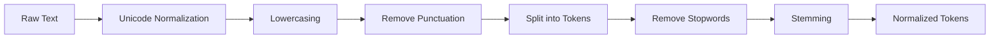

# 04. Tokenization Pipeline

**Project:** TROVIX  
**Module:** Indexing Engine  
**Version:** 1.0  
**Author:** Paridhi Sharma (Indexing Lead)

---

# Table of Contents

1. Introduction
2. Problem Statement
3. What is Tokenization?
4. Objectives
5. Pipeline Overview
6. Tokenization Workflow
7. Pipeline Stages
8. Token Design
9. Design Decisions
10. Complexity Analysis
11. Future Improvements
12. Conclusion

---

# Introduction

Tokenization is one of the most critical stages of the indexing pipeline.

Before a search engine can index, rank, or retrieve documents, raw text must first be transformed into a structured representation that the indexing engine can understand.

The Tokenization Pipeline is responsible for converting unstructured human language into normalized search terms known as **tokens**.

Every document and every user query processed by TROVIX passes through this exact same pipeline.

Maintaining a single preprocessing pipeline ensures consistency between indexing and retrieval, which is essential for accurate search results.

---

# Problem Statement

Human language is inherently inconsistent.

The same concept can appear in many different forms.

For example,

```
Machine

machine

MACHINE

Machines

machine.
```

To a human reader,

all of these represent the same concept.

To a computer,

they are completely different strings.

Without preprocessing,

the search engine would create five separate vocabulary entries.

```
Machine

machine

MACHINE

Machines

machine.
```

This leads to

- Larger vocabulary
- Lower retrieval accuracy
- Duplicate index entries
- Poor ranking quality

The objective of tokenization is to normalize textual data so that equivalent words are represented by a single standardized token.

---

# What is Tokenization?

Tokenization is the process of breaking raw text into individual searchable units called **tokens**.

Consider the following sentence.

```
Machine Learning is transforming software engineering.
```

After tokenization,

```
Machine

Learning

is

transforming

software

engineering
```

These tokens then pass through several normalization stages before being inserted into the inverted index.

Tokenization serves as the foundation for every subsequent indexing operation.

---

# Objectives

The tokenization pipeline has several primary objectives.

## Normalize Text

Equivalent words should produce identical tokens.

Example

```
Machine

machine

MACHINE
```

↓

```
machine
```

---

## Reduce Vocabulary Size

Different representations of the same word should not create multiple vocabulary entries.

Example

```
run

running

runs
```

↓

```
run
```

---

## Improve Retrieval Accuracy

A query should match documents regardless of capitalization or punctuation.

Searching

```
Machine
```

should retrieve documents containing

```
machine

MACHINE

Machine
```

---

## Prepare Data for Indexing

The output of the tokenizer should be immediately consumable by the Index Builder.

The tokenizer should not perform

- Ranking
- Posting List Updates
- BM25 Calculations

Its sole responsibility is text normalization.

---

# Pipeline Overview

The TROVIX tokenization pipeline consists of several sequential stages.



Each stage performs one transformation.

The output of one stage becomes the input of the next.

This modular design makes the tokenizer easier to test, maintain, and extend.

---

# Why Use a Pipeline?

Instead of performing all preprocessing inside one large function,

TROVIX separates every transformation into independent stages.

Advantages include

- Easier debugging
- Better unit testing
- Cleaner implementation
- Improved maintainability
- Easy insertion of future processing stages

For example,

future versions may introduce

```
Spell Correction

↓

Synonym Expansion

↓

Entity Recognition
```

without modifying existing components.

---

# Tokenization Workflow

Consider the following document.

```
"Machine Learning, in 2026, is AMAZING!"
```

The tokenizer processes it step by step.

## Stage 1

Input

```
Machine Learning, in 2026, is AMAZING!
```

↓

Unicode Normalization

↓

```
Machine Learning, in 2026, is AMAZING!
```

---

## Stage 2

Lowercase

↓

```
machine learning, in 2026, is amazing!
```

---

## Stage 3

Remove punctuation

↓

```
machine learning in 2026 is amazing
```

---

## Stage 4

Split into words

↓

```
machine

learning

in

2026

is

amazing
```

---

## Stage 5

Remove stopwords

↓

```
machine

learning

2026

amazing
```

---

## Stage 6

Stem

↓

```
machin

learn

2026

amaz
```

---

The resulting tokens are forwarded directly to the Index Builder.

---

# Pipeline Principles

Every transformation inside the tokenizer follows three principles.

## Deterministic

The same input should always produce the same output.

---

## Stateless

The tokenizer should not retain information from previously processed documents.

Each document is processed independently.

---

## Reusable

The same tokenizer implementation should be used during

- Document Indexing
- Query Processing

This guarantees identical normalization behavior across the entire search engine.

---

# Summary

The Tokenization Pipeline serves as the bridge between raw human language and the structured data required by the indexing engine.

By converting inconsistent text into normalized tokens, TROVIX reduces vocabulary size, improves retrieval accuracy, and prepares documents for efficient indexing.

The following sections define each stage of the pipeline in detail, beginning with Unicode normalization and progressing through lowercasing, punctuation removal, stopword filtering, and stemming.

---

# Pipeline Stages

The TROVIX tokenization pipeline is composed of several independent transformation stages.

Each stage receives the output of the previous stage, performs exactly one operation, and passes the transformed text to the next stage.

This modular approach makes the pipeline easier to understand, test, optimize, and extend.

The current pipeline consists of six stages.

1. Unicode Normalization
2. Lowercasing
3. Punctuation Removal
4. Token Splitting
5. Stopword Removal
6. Stemming

---

# Stage 1 — Unicode Normalization

## Purpose

Different operating systems, text editors, and file formats may represent visually identical characters using different Unicode encodings.

Without normalization,

these characters become different vocabulary entries.

Example

```
Café

Café
```

Although they appear identical,

their underlying Unicode representations differ.

Without normalization,

the search engine would treat them as different words.

---

## Example

Input

```
Café
```

Unicode Normalized

```
Café
```

Both representations now generate identical tokens.

---

## Why Is This Important?

Unicode normalization improves

- Vocabulary consistency
- Search accuracy
- Cross-platform compatibility

Future multilingual support also depends on consistent Unicode processing.

---

# Stage 2 — Lowercasing

## Purpose

Capitalization should not affect search results.

Example

```
Machine

machine

MACHINE

Machine
```

All of these represent the same concept.

Without lowercasing,

the vocabulary would contain

```
Machine

machine

MACHINE
```

instead of

```
machine
```

---

## Transformation

Input

```
Machine Learning
```

↓

Output

```
machine learning
```

---

## Benefits

Lowercasing

- Reduces vocabulary size
- Improves matching accuracy
- Simplifies indexing

This is one of the simplest yet most effective normalization steps.

---

# Stage 3 — Punctuation Removal

## Purpose

Punctuation generally carries little semantic meaning during keyword search.

Example

```
Machine,

Machine.

Machine!

Machine?
```

All should produce

```
machine
```

---

## Transformation

Input

```
Machine, Learning!
```

↓

Output

```
Machine Learning
```

---

## Characters Removed

Typical punctuation includes

```
.

,

!

?

:

;

"

'

(

)

[ ]

{ }

-

_
```

Future implementations may preserve selected punctuation for specialized use cases such as programming languages or email addresses.

---

## Why Remove Punctuation?

Without punctuation removal,

the following become different terms.

```
python

python,

python.
```

Removing punctuation significantly reduces unnecessary vocabulary growth.

---

# Stage 4 — Token Splitting

## Purpose

The tokenizer must separate continuous text into individual words.

Example

Input

```
Machine Learning transforms software engineering.
```

↓

Output

```
Machine

Learning

transforms

software

engineering
```

Each word becomes an independent token.

---

## Delimiters

Version 1 splits text using

- Spaces
- Tabs
- Newlines

Future versions may also support

- Hyphen handling
- CamelCase splitting
- Programming identifiers
- URL tokenization

---

## Why Token Splitting?

The inverted index operates on individual terms.

Without tokenization,

the search engine would attempt to index entire sentences.

Example

```
Machine Learning transforms software engineering.
```

instead of

```
machine

learning

transforms

software

engineering
```

---

# Stage 5 — Stopword Removal

## Purpose

Some words appear extremely frequently while contributing little semantic meaning.

Examples include

```
the

is

of

and

to

in

for
```

These are known as **stopwords**.

---

## Example

Input

```
The machine is in the laboratory.
```

↓

Tokenized

```
the

machine

is

in

the

laboratory
```

↓

Stopword Removal

```
machine

laboratory
```

---

## Benefits

Removing stopwords

- Reduces vocabulary size
- Decreases index size
- Improves retrieval efficiency
- Eliminates noisy terms

---

## Why Not Remove Every Common Word?

Some applications require preserving stopwords.

Example

```
To Be or Not To Be
```

Removing stopwords destroys the meaning.

Therefore,

future versions of TROVIX may allow configurable stopword lists depending on the application.

---

# Stage 6 — Stemming

## Purpose

Different grammatical forms of the same word should map to a common root.

Example

```
run

running

runs

runner
```

↓

Stem

```
run
```

This prevents unnecessary duplication inside the vocabulary.

---

## Example

Input

```
Searching searches searched searching
```

↓

Output

```
search

search

search

search
```

---

## Benefits

Stemming

- Reduces vocabulary size
- Improves recall
- Simplifies matching
- Produces more compact indexes

---

## Porter Stemmer

Version 1 of TROVIX will use the Porter Stemmer because it is

- Fast
- Well-tested
- Widely used
- Suitable for English text

Future implementations may optionally support

- Snowball Stemmer
- Lancaster Stemmer
- Language-specific stemmers

---

# Stemming vs Lemmatization

Although both techniques normalize words,

they differ significantly.

| Stemming | Lemmatization |
|-----------|---------------|
| Rule-based | Dictionary-based |
| Faster | Slower |
| Less accurate | More accurate |
| Lightweight | Computationally expensive |

Example

```
running
```

Stemming

```
run
```

Lemmatization

```
run
```

Another example

```
better
```

Stemming

```
better
```

Lemmatization

```
good
```

Lemmatization produces linguistically correct roots but requires additional language models.

---

# Why TROVIX Chooses Stemming

Version 1 prioritizes

- Performance
- Simplicity
- Fast indexing

Therefore,

stemming provides the best trade-off.

The architecture allows lemmatization to replace or complement stemming in future versions.

---

# Complete Example

Consider the following input.

```
"The Machines are Running Quickly!"
```

Stage 1

Unicode Normalization

↓

```
The Machines are Running Quickly!
```

Stage 2

Lowercase

↓

```
the machines are running quickly!
```

Stage 3

Remove Punctuation

↓

```
the machines are running quickly
```

Stage 4

Split Tokens

↓

```
the

machines

are

running

quickly
```

Stage 5

Remove Stopwords

↓

```
machines

running

quickly
```

Stage 6

Stem

↓

```
machin

run

quickli
```

These normalized tokens are finally passed to the Index Builder for inverted index construction.

---

# Complexity Analysis

The Tokenization Pipeline performs a sequence of linear transformations over the input text.

Each stage processes every character or token exactly once before passing the output to the next stage.

Since no stage performs nested iteration over the entire document, the overall complexity remains linear.

---

## Notation

Throughout this section,

| Symbol | Description |
|---------|-------------|
| **L** | Number of characters in the document |
| **T** | Number of generated tokens |
| **S** | Number of stopwords |

---

# Unicode Normalization

Unicode normalization scans the input text once and converts characters into a canonical representation.

Example

```
Café

↓

Café
```

Complexity

```
O(L)
```

where

```
L
```

is the number of characters.

---

# Lowercasing

Every character is converted to lowercase.

Example

```
Machine Learning

↓

machine learning
```

Complexity

```
O(L)
```

---

# Punctuation Removal

The tokenizer scans each character and removes punctuation symbols.

Example

```
Hello, World!

↓

Hello World
```

Complexity

```
O(L)
```

---

# Token Splitting

The normalized string is split into individual words.

Example

```
machine learning python
```

↓

```
machine

learning

python
```

Complexity

```
O(L)
```

---

# Stopword Removal

Every generated token is checked against the stopword collection.

Example

```
machine

is

learning
```

↓

```
machine

learning
```

Assuming the stopword list is implemented as a hash set,

lookup complexity is

```
O(1)
```

for each token.

Overall complexity

```
O(T)
```

---

# Stemming

Every remaining token is processed independently.

Example

```
running

↓

run
```

Complexity

```
O(T)
```

where

```
T
```

is the number of remaining tokens.

---

# Overall Pipeline Complexity

The pipeline performs several independent linear passes.

```
Unicode

+

Lowercase

+

Punctuation Removal

+

Split

+

Stopword Removal

+

Stemming
```

Overall complexity

```
O(L + T)
```

Since

```
T ≤ L
```

the overall complexity is effectively

```
O(L)
```

The tokenizer therefore scales linearly with document size.

---

# Space Complexity

During processing,

the tokenizer temporarily stores

- Normalized text
- Token list
- Filtered token list

Overall space complexity

```
O(T)
```

where

```
T
```

is the number of generated tokens.

No additional permanent storage is required.

---

# Performance Considerations

The tokenizer should satisfy the following performance goals.

- Process each character only once whenever possible.
- Avoid duplicate string allocations.
- Reuse compiled regular expressions.
- Store stopwords in a hash set.
- Avoid unnecessary object creation.
- Keep transformations stateless.

Following these principles ensures that tokenization remains efficient even for large document collections.

---

# Future Improvements

Although the Version 1 tokenizer focuses on lexical normalization, several enhancements are planned.

---

## Lemmatization

Replace or supplement stemming with dictionary-based lemmatization.

Example

```
better

↓

good
```

Benefits

- Better linguistic accuracy
- Improved retrieval quality

Trade-off

Higher computational cost.

---

## Synonym Expansion

Different words often express the same concept.

Example

```
car

↓

automobile

vehicle
```

Adding synonym expansion can improve recall for user queries.

---

## N-Gram Generation

Generate token sequences instead of individual words.

Example

```
machine learning search engine
```

↓

```
machine learning

learning search

search engine
```

Benefits

- Phrase search
- Better ranking
- Context preservation

---

## Language Detection

Automatically determine the language of each document before tokenization.

Example

```
English

↓

English Tokenizer
```

```
Hindi

↓

Hindi Tokenizer
```

This enables multilingual indexing.

---

## Custom Stopword Lists

Different domains require different stopword sets.

Example

Medical documents

↓

Medical stopwords

Software repositories

↓

Programming stopwords

Future versions should allow custom stopword configurations.

---

## Entity Recognition

Instead of treating every word independently,

future versions may identify named entities.

Example

```
New York City
```

↓

```
New_York_City
```

Benefits

- Better semantic search
- Improved ranking
- Knowledge graph integration

---

## Spell Correction

Future versions may normalize spelling mistakes.

Example

```
machne

↓

machine
```

This improves search quality for misspelled queries.

---

# References

## Books

- *Introduction to Information Retrieval* — Manning, Raghavan & Schütze
- *Speech and Language Processing* — Jurafsky & Martin

---

## Documentation

- NLTK Documentation
- spaCy Documentation
- Unicode Standard Documentation

---

## Research

- Porter, M. F. (1980). *An Algorithm for Suffix Stripping.*
- Unicode Consortium Documentation

---

# Conclusion

The Tokenization Pipeline is responsible for converting raw human language into a consistent representation suitable for indexing.

By applying a sequence of deterministic transformations—including Unicode normalization, lowercasing, punctuation removal, token splitting, stopword filtering, and stemming—TROVIX produces normalized tokens that maximize retrieval accuracy while minimizing vocabulary growth.

The pipeline has been designed to be modular, configurable, and reusable across both document indexing and query processing.

Its output serves as the direct input to the Index Builder, making it one of the most critical components in the TROVIX indexing architecture.

---

## Key Takeaways

The Tokenization Pipeline ensures that:

- Raw text is converted into normalized tokens.
- Equivalent words map to a common representation.
- Vocabulary growth is minimized.
- Query processing and document indexing remain consistent.
- Future linguistic enhancements can be integrated without redesigning the pipeline.

With this component complete, TROVIX now has a fully specified preprocessing layer capable of transforming raw documents into structured tokens ready for inverted index construction.

The next document focuses on the **Index Builder**, where parsed documents and normalized tokens are transformed into the searchable inverted index that powers TROVIX.