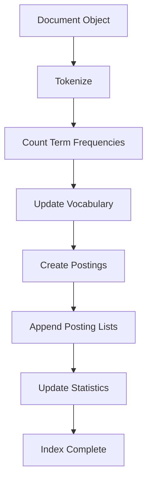
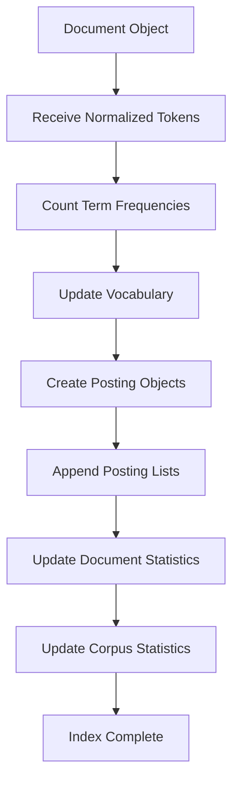
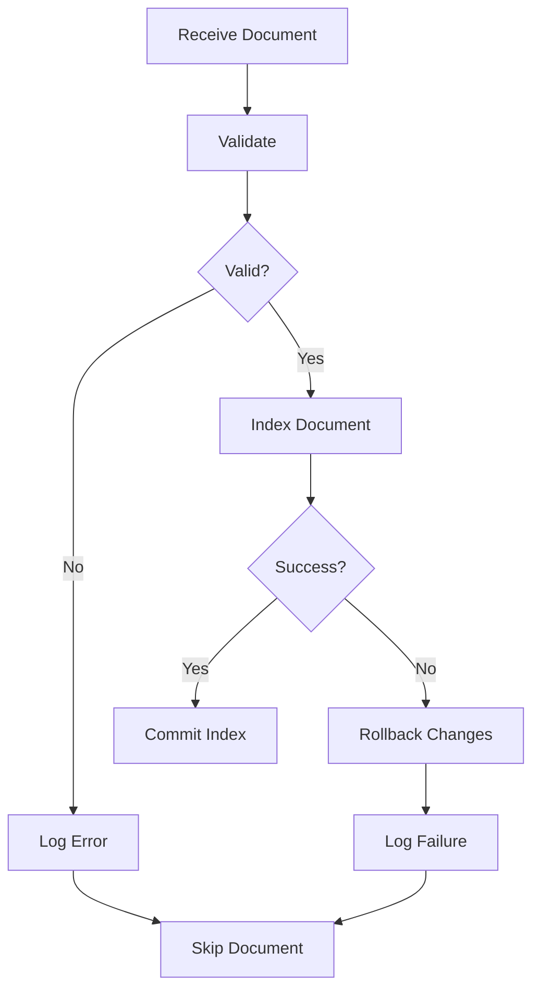

# 05. Index Builder

**Project:** TROVIX  
**Module:** Indexing Engine  
**Version:** 1.0  
**Author:** Paridhi Sharma (Indexing Lead)

---

# Table of Contents

1. Introduction
2. Problem Statement
3. Responsibilities
4. Design Goals
5. Overall Architecture
6. Index Building Pipeline
7. Core Components
8. Index Builder Workflow
9. Index State Management
10. Design Decisions
11. Complexity Analysis
12. Future Improvements
13. Conclusion

---

# Introduction

The Index Builder is the central component of the TROVIX indexing engine.

While the Document Parser extracts structured documents and the Tokenization Pipeline generates normalized tokens, the Index Builder is responsible for transforming these tokens into the searchable inverted index.

Every document added to TROVIX passes through the Index Builder exactly once during indexing.

Its primary objective is to organize information efficiently so that future search queries can retrieve relevant documents without scanning the original corpus.

The Index Builder serves as the bridge between document preprocessing and information retrieval.

---

# Problem Statement

After parsing and tokenization, TROVIX possesses a collection of normalized tokens.

For example,

```
Document 17

↓

machine

learning

python

database
```

At this stage,

the search engine still cannot answer questions such as

```
Which documents contain "machine"?
```

or

```
How many times does "python" appear inside Document 17?
```

The normalized tokens exist,

but they have not yet been organized into an efficient retrieval structure.

The role of the Index Builder is therefore to convert these tokens into an inverted index.

Instead of storing documents sequentially,

```
Document

↓

Words
```

the Index Builder creates a reverse mapping.

```
Word

↓

Documents
```

This transformation enables fast keyword retrieval.

---

# Responsibilities

The Index Builder has several well-defined responsibilities.

It is responsible for

- Receiving parsed documents.
- Receiving normalized tokens.
- Computing term frequencies.
- Updating the vocabulary.
- Creating postings.
- Updating posting lists.
- Maintaining document statistics.
- Maintaining corpus statistics.

The Index Builder is **not** responsible for

- Parsing files.
- Tokenizing text.
- Ranking search results.
- Executing user queries.

Those responsibilities belong to other components.

---

# Design Goals

The Index Builder has been designed with the following objectives.

## Efficiency

Every document should be processed only once.

Repeated scans of the same document should be avoided.

---

## Modularity

The Index Builder should interact with

- Document Parser
- Tokenizer
- Inverted Index

without becoming dependent on their internal implementations.

---

## Correctness

Every indexed document should produce

- correct posting lists,
- correct term frequencies,
- correct document statistics.

Consistency is more important than premature optimization.

---

## Scalability

The architecture should support growth from thousands of documents to millions of documents with minimal redesign.

---

## Extensibility

Future features such as

- Positional Indexes
- Incremental Indexing
- Distributed Indexing

should integrate naturally into the existing design.

---

# Overall Architecture

The Index Builder sits between preprocessing and storage.


The parser produces structured documents.

The tokenizer produces normalized tokens.

The Index Builder consumes both and updates the inverted index accordingly.

---

# Why Separate the Index Builder?

An alternative approach would allow the tokenizer to update the inverted index directly.

```
Tokenizer

↓

Update Index
```

This tightly couples preprocessing with storage.

Instead,

TROVIX separates concerns.

```
Tokenizer

↓

Tokens

↓

Index Builder

↓

Inverted Index
```

Benefits include

- Cleaner architecture
- Easier testing
- Better maintainability
- Independent component evolution

The tokenizer focuses only on language processing.

The Index Builder focuses only on index construction.

---

# Index Building Pipeline

Every document follows the same indexing workflow.



Each stage performs exactly one responsibility.

This deterministic pipeline guarantees reproducible indexing results.

---

# Core Components

The Index Builder interacts with four primary data structures.

```
                Index Builder

                      │

      ┌───────────────┼───────────────┐

      ▼               ▼               ▼

Document        Vocabulary      Posting Lists

                      │

                      ▼

             Document Statistics
```

Each structure is updated independently, allowing individual components to evolve without affecting the others.

---

# Summary

The Index Builder is the heart of the TROVIX indexing engine.

It transforms normalized tokens into an efficient inverted index by coordinating vocabulary updates, posting list construction, and statistical bookkeeping.

Every search operation performed by TROVIX ultimately depends on the correctness of the Index Builder, making it one of the most critical components in the entire system.

The following sections describe its workflow, algorithms, and implementation in detail.

---

# Index Builder Workflow

The Index Builder follows a deterministic sequence of operations for every document in the corpus.

Rather than updating the inverted index directly from raw text, the Index Builder processes structured `Document` objects together with their normalized tokens.

Each document is indexed independently, ensuring that failures affecting one document do not compromise the integrity of the remaining index.

The workflow remains identical regardless of document size or content.

---

# Complete Indexing Workflow



Every stage has a clearly defined responsibility.

---

# Step 1 — Receive the Document

The Index Builder receives two inputs.

- A parsed `Document` object
- A list of normalized tokens

Example

```python
Document(
    id=17,
    filename="machine_learning.txt"
)
```

Tokens

```python
[
    "machine",
    "learn",
    "python",
    "machine"
]
```

The parser and tokenizer have already completed their work.

The Index Builder never modifies either input.

---

# Step 2 — Count Term Frequencies

The next step is determining how many times every unique token appears inside the document.

Example

Input

```text
machine

learn

python

machine

machine
```

Frequency Table

| Token | Frequency |
|--------|-----------|
| machine | 3 |
| learn | 1 |
| python | 1 |

This frequency table becomes the basis for creating postings.

---

# Why Count Frequencies First?

Suppose the Index Builder immediately created a posting for every token.

```
machine

↓

Posting

↓

Posting

↓

Posting
```

The posting list would contain duplicate entries for the same document.

Instead,

the Index Builder first aggregates frequencies.

```
machine

↓

Frequency = 3

↓

Single Posting
```

This significantly reduces index size and is required for BM25 scoring.

---

# Step 3 — Update the Vocabulary

The Index Builder now processes every unique term.

For each token,

the vocabulary is checked.

Workflow

```text
Token

↓

Exists?

↓

Yes ------------------> Retrieve Posting List

↓

No

↓

Create Posting List

↓

Insert into Vocabulary
```

Every unique term owns exactly one posting list.

No duplicate vocabulary entries should ever exist.

---

# Step 4 — Create Posting Objects

Once the posting list has been located,

a Posting object is created.

Example

```python
Posting(

    document_id=17,

    term_frequency=3

)
```

This posting represents

> "The term appears three times inside Document 17."

The posting does not contain

- document text
- filenames
- metadata

Only information required for retrieval and ranking.

---

# Step 5 — Append to the Posting List

The posting is appended to the posting list corresponding to the current term.

Before

```python
machine

↓

[
    Posting(3,2),

    Posting(9,1)
]
```

After

```python
machine

↓

[
    Posting(3,2),

    Posting(9,1),

    Posting(17,3)
]
```

The posting list now reflects the updated corpus.

---

# Step 6 — Update Document Statistics

After all postings have been created,

document-level statistics are recorded.

Example

```python
document_lengths[17] = 243
```

Additional statistics may include

- Number of unique terms
- Maximum term frequency
- Average term frequency

Version 1 stores only document length because it is required for BM25.

---

# Step 7 — Update Corpus Statistics

Finally,

the Index Builder updates global statistics.

Example

```python
total_documents += 1

average_document_length = ...
```

These values describe the corpus as a whole.

Unlike posting lists,

they are independent of any individual term.

---

# Complete Algorithm

The indexing process can be summarized as follows.

```text
Receive Document

↓

Receive Tokens

↓

Count Term Frequencies

↓

For Each Unique Token

    Lookup Vocabulary

    Create Posting List if Necessary

    Create Posting

    Append Posting

Update Document Statistics

Update Corpus Statistics

Index Complete
```

This algorithm guarantees

- One vocabulary entry per term.
- One posting per document.
- Accurate BM25 statistics.
- Consistent index state.

---

# Why This Workflow?

The ordering of operations is intentional.

For example,

posting lists are never updated before term frequencies are known.

Similarly,

corpus statistics are updated only after successful indexing.

This prevents inconsistent state in the event of failures.

Each stage depends only on the successful completion of the previous stage, making the workflow deterministic and easy to test.

---

# Design Principles

The Index Builder follows several architectural principles.

## Single Pass Processing

Each document is processed exactly once.

No repeated scanning occurs after tokenization.

---

## Separation of Responsibilities

Each stage performs one task only.

Examples

- Frequency counting
- Vocabulary updates
- Posting creation
- Statistics updates

Keeping these responsibilities separate improves readability and maintainability.

---

## Deterministic Execution

Given identical input,

the Index Builder should always produce an identical inverted index.

This property is essential for reproducible indexing and debugging.

---

## Failure Isolation

If indexing one document fails,

the remaining documents should continue processing.

A single corrupted document should never invalidate the entire indexing operation.

---

# Summary

The Index Builder Workflow defines the exact sequence of operations required to transform normalized tokens into a searchable inverted index.

By separating frequency computation, vocabulary management, posting creation, and statistical updates into independent stages, TROVIX achieves a modular and reliable indexing process.

This workflow serves as the implementation blueprint for `index_builder.py` and establishes the foundation upon which all future retrieval operations depend.

---

# Index State Management

The Index Builder is responsible not only for constructing the inverted index but also for ensuring that the index remains internally consistent throughout the indexing process.

Every modification to the index changes its internal state.

If these updates are performed incorrectly or out of order, the resulting index may become inconsistent, leading to incorrect search results, inaccurate BM25 scores, or corrupted posting lists.

This section defines how TROVIX manages index state during document ingestion.

---

# What is Index State?

The **state** of the index refers to every piece of information maintained by the indexing engine at a given point in time.

This includes

- Vocabulary
- Posting Lists
- Document Statistics
- Corpus Statistics

Conceptually,

```text
                Index State

                     │

      ┌──────────────┼──────────────┐

      ▼              ▼              ▼

 Vocabulary     Posting Lists   Statistics
```

Each indexed document modifies this state.

---

# State Before Indexing

Suppose TROVIX has just started.

Initially,

```python
Vocabulary = {}

Posting Lists = {}

Document Lengths = {}

Total Documents = 0

Average Document Length = 0
```

This represents an empty search index.

---

# State After Indexing One Document

Consider

```
Document 1

Machine Learning Machine
```

After tokenization,

```
machine

learn

machine
```

The Index Builder updates every structure.

Vocabulary

```python
{
    "machine": PostingList(),

    "learn": PostingList()
}
```

Posting Lists

```python
machine

↓

[
    Posting(1,2)
]

-------------------

learn

↓

[
    Posting(1,1)
]
```

Document Statistics

```python
{
    1: 3
}
```

Corpus Statistics

```python
Total Documents = 1

Average Document Length = 3
```

The index is now internally consistent.

---

# State Transition

Each indexed document causes a controlled state transition.

```text
Current Index

↓

Receive Document

↓

Validate Input

↓

Update Vocabulary

↓

Update Posting Lists

↓

Update Statistics

↓

New Index State
```

The transition should always be atomic from the perspective of the indexing process.

---

# Atomic Updates

The Index Builder should never leave the index partially updated.

Incorrect sequence

```text
Update Vocabulary

↓

Crash

↓

Posting List Missing
```

Result

```
Vocabulary Entry Exists

↓

Posting List Missing
```

The index becomes inconsistent.

---

Correct sequence

```text
Build Posting

↓

Append Posting

↓

Update Statistics

↓

Commit
```

Only after every operation succeeds should the document be considered indexed.

---

# Maintaining Consistency

After every successful indexing operation,

the following conditions must hold.

## Vocabulary Consistency

Every vocabulary term must reference a valid posting list.

Example

```python
{
    "machine": PostingList(...)
}
```

Invalid

```python
{
    "machine": None
}
```

---

## Posting Consistency

Every posting must reference an existing document.

Example

```python
Posting(

    document_id=17,

    term_frequency=4
)
```

The corresponding document must exist within the corpus.

---

## Statistics Consistency

Document statistics and corpus statistics must remain synchronized.

Example

```
Document Length

↓

243 Tokens
```

The document length should always equal the number of tokens produced by the tokenizer.

Similarly,

```
Average Document Length
```

must reflect every indexed document.

---

# Batch Indexing

Version 1 of TROVIX performs batch indexing.

Workflow

```text
Corpus

↓

Document 1

↓

Document 2

↓

Document 3

↓

...

↓

Document N

↓

Complete Index
```

Advantages

- Simpler implementation
- Easier debugging
- Predictable performance
- Lower synchronization complexity

Batch indexing is well suited for static collections.

---

# Incremental Indexing

Future versions will support adding documents without rebuilding the entire index.

Workflow

```text
Existing Index

↓

New Document

↓

Update Posting Lists

↓

Update Statistics

↓

Index Ready
```

Benefits

- Faster updates
- Near real-time indexing
- Better production usability

This feature introduces additional complexity because existing data structures must remain consistent while being modified.

---

# Failure Recovery

Index construction should tolerate individual failures.

Example

```text
Document 87

↓

File Corrupted

↓

Skip

↓

Continue Indexing
```

The failure of one document must not invalidate the remaining index.

Every failure should

- be logged,
- identify the affected document,
- preserve index consistency.

---

# Validation Before Commit

Before accepting an indexed document,

the following checks should pass.

- Document ID is unique.
- Vocabulary updated successfully.
- Posting lists created correctly.
- Document statistics recorded.
- Corpus statistics updated.
- No duplicate postings created.

Only after validation succeeds should the index state be updated.

---

# State Management Principles

The Index Builder follows several principles to ensure reliability.

- Every state transition must be deterministic.
- Every document is indexed independently.
- Statistics are updated only after successful indexing.
- Posting lists are never partially modified.
- Vocabulary remains the single source of truth.
- The index should always remain searchable after a successful update.

These principles make the indexing engine easier to debug, test, and extend.

---

# Summary

Index State Management ensures that every update performed by the Index Builder preserves the integrity of the inverted index.

By treating indexing as a sequence of controlled state transitions, TROVIX maintains consistent vocabulary entries, posting lists, and statistical information throughout the indexing process.

This disciplined approach lays the foundation for future features such as incremental indexing, persistent storage, and distributed search infrastructure.

---

# Failure Scenarios & Recovery

Building an inverted index is a long-running operation that processes thousands or even millions of documents.

During this process, failures are inevitable.

Files may be corrupted, storage devices may fail, documents may contain invalid data, or unexpected exceptions may occur.

The Index Builder must therefore be designed to handle failures gracefully while preserving the integrity of the index.

The primary objective is simple:

> **A single failure should never corrupt the entire index.**

---

# Failure Philosophy

TROVIX follows three fundamental principles when handling failures.

1. **Fail Fast**

Detect invalid input as early as possible.

2. **Fail Safely**

Never leave the inverted index in an inconsistent state.

3. **Recover Automatically**

Skip the problematic document whenever possible and continue indexing the remaining corpus.

---

# Categories of Failures

Failures encountered during indexing generally fall into five categories.

```text
                 Failures

                     │

      ┌──────────────┼──────────────┐

      ▼              ▼              ▼

 Input Errors   Processing Errors   Storage Errors

                     │

      ┌──────────────┼──────────────┐

      ▼                             ▼

 Metadata Errors             Internal Errors
```

Each category requires different recovery strategies.

---

# Invalid Documents

The parser may produce invalid or incomplete documents.

Example

```python
Document(

    id=None,

    filename="",

    content=None

)
```

Such documents cannot be indexed.

### Recovery Strategy

- Reject the document.
- Log the reason.
- Continue indexing.

Example log

```
ERROR

Document rejected.

Reason:
Missing content.
```

---

# Duplicate Document IDs

Every document must have a unique identifier.

Example

```
Document 17

↓

Already Exists
```

Allowing duplicate IDs would corrupt posting lists.

### Recovery Strategy

Before indexing,

verify that the document ID does not already exist.

If it does,

either

- reject the document,

or

- assign a new identifier,

depending on future configuration.

Version 1 rejects duplicates.

---

# Empty Token Lists

A document may become empty after preprocessing.

Example

Original

```
the

is

of

and
```

After stopword removal

```
(empty)
```

### Recovery Strategy

The document should still be counted within the corpus,

but no postings should be generated.

Document statistics remain valid.

---

# Vocabulary Update Failure

Suppose the vocabulary update fails.

```
Token

↓

Vocabulary Insert

↓

Exception
```

The posting list should **never** be created if the vocabulary entry was not successfully inserted.

Partial updates are prohibited.

---

# Posting Creation Failure

Suppose memory allocation fails while creating a posting.

```
Posting

↓

Memory Error
```

### Recovery Strategy

The posting list should remain unchanged.

The document should not be partially indexed.

---

# Statistics Update Failure

Statistics should only be updated after postings have been successfully inserted.

Incorrect sequence

```text
Update Statistics

↓

Posting Creation Fails
```

Result

```
Document Count

Incorrect
```

Correct sequence

```text
Posting Created

↓

Posting Inserted

↓

Statistics Updated
```

Statistics are always the final step.

---

# Unexpected Exceptions

Unexpected runtime exceptions may occur.

Examples

- Memory exhaustion
- Invalid object state
- Serialization failure
- Programming errors

### Recovery Strategy

Catch the exception.

Log

- document ID,
- filename,
- exception type,
- stack trace.

Skip the document and continue processing.

The indexing process should terminate only if recovery is impossible.

---

# Transactional Thinking

Although Version 1 does not implement database transactions,

the indexing workflow should behave similarly.

Conceptually,

```
Begin Index Update

↓

All Operations Succeed?

↓

Yes

↓

Commit

------------------------

No

↓

Rollback
```

Rollback simply means

> "Do not modify the index."

This prevents inconsistent state.

---

# Logging and Monitoring

Every failure should generate structured logs.

Example

```
ERROR

Timestamp:
2026-07-15 10:32:08

Document ID:
183

Filename:
machine_learning.txt

Stage:
Posting Creation

Reason:
MemoryError
```

Useful logging dramatically reduces debugging time.

---

# Recovery Workflow



The workflow ensures that the index is either

- fully updated,

or

- not updated at all.

Partial indexing is never allowed.

---

# Validation Checklist

Before committing an indexed document,

verify the following.

| Validation | Required |
|------------|----------|
| Document ID Exists | ✅ |
| Content Available | ✅ |
| Tokens Generated Successfully | ✅ |
| Vocabulary Updated | ✅ |
| Posting Lists Updated | ✅ |
| Document Statistics Updated | ✅ |
| Corpus Statistics Updated | ✅ |

Only after every validation succeeds should the document become searchable.

---

# Design Principles

Failure handling follows several architectural principles.

- Never partially update the index.
- Every failure must be logged.
- Every document is processed independently.
- Continue indexing whenever recovery is possible.
- Preserve index consistency above all else.
- Make failures observable through structured logs.

These principles ensure that TROVIX remains reliable even when processing imperfect datasets.

---

# Summary

Robust failure handling is essential for building a reliable search engine.

By validating input, isolating failures, avoiding partial updates, and maintaining strict consistency guarantees, the Index Builder ensures that unexpected errors affect only the current document rather than the entire corpus.

This approach provides a strong foundation for future capabilities such as persistent indexes, distributed indexing, and incremental updates while maintaining the correctness of the inverted index.

---

# Complexity Analysis

The Index Builder is responsible for transforming normalized tokens into an inverted index.

Its performance directly affects the time required to build the searchable corpus.

Since indexing is performed offline, throughput is generally more important than latency.

The algorithms used throughout TROVIX are intentionally designed to scale linearly with the size of the corpus.

---

# Notation

Throughout this analysis, the following symbols are used.

| Symbol | Description |
|----------|-------------|
| **N** | Number of documents |
| **T** | Total number of tokens across the corpus |
| **U** | Number of unique tokens within one document |
| **V** | Vocabulary size |

---

# Term Frequency Computation

Before updating the index, the Index Builder computes the frequency of every unique token inside a document.

Example

```
machine

machine

learning

python

machine
```

↓

```
machine → 3

learning → 1

python → 1
```

Assuming a hash map is used,

each token contributes one update.

Time Complexity

```
O(Td)
```

where

```
Td
```

represents the number of tokens in the current document.

---

# Vocabulary Lookup

Each unique token requires a vocabulary lookup.

Implementation

```python
vocabulary[token]
```

Average Complexity

```
O(1)
```

Worst Case

```
O(V)
```

Python dictionaries provide near constant-time performance in practice.

---

# Posting Creation

One posting is created for every unique term inside the document.

Example

```
machine

↓

Posting(
    document_id=17,
    term_frequency=3
)
```

Posting creation is constant time.

```
O(1)
```

---

# Posting List Updates

Appending a posting to a posting list requires amortized constant time.

```
Posting List

↓

Append Posting
```

Complexity

```
O(1)
```

---

# Statistics Updates

Updating document statistics requires one insertion.

Example

```python
document_lengths[17] = 243
```

Corpus statistics update only once per document.

Complexity

```
O(1)
```

---

# Overall Complexity Per Document

For one document,

the Index Builder performs

- Frequency Counting
- Vocabulary Lookups
- Posting Creation
- Posting List Updates
- Statistics Updates

Overall

```
O(Td)
```

where

```
Td
```

is the number of tokens in the document.

---

# Overall Corpus Complexity

Across the entire corpus,

```
O(T)
```

where

```
T
```

represents the total number of tokens processed.

This linear complexity makes the indexing pipeline highly scalable.

---

# Space Complexity

The Index Builder stores

- Vocabulary
- Posting Lists
- Document Statistics
- Corpus Statistics

Overall space complexity

```
O(T)
```

since every indexed token contributes exactly one posting.

Additional bookkeeping structures require comparatively little memory.

---

# Performance Targets

Version 1 aims to satisfy the following goals.

| Metric | Target |
|---------|--------|
| Indexed Documents | 50,000+ |
| Vocabulary Lookup | O(1) |
| Posting Append | O(1) |
| Index Build | O(T) |
| Memory Growth | Linear |
| Duplicate Postings | None |

These benchmarks will later be verified using performance testing.

---

# Future Improvements

Although the current implementation prioritizes simplicity and correctness, several improvements are planned.

---

## Parallel Index Construction

Documents are currently indexed sequentially.

Future versions may partition the corpus across multiple worker threads.

```text
Corpus

↓

Worker 1

Worker 2

Worker 3

↓

Merge Partial Indexes

↓

Final Index
```

Benefits

- Faster indexing
- Better CPU utilization
- Reduced indexing time

---

## Incremental Indexing

Rather than rebuilding the index,

new documents can update existing posting lists.

Benefits

- Real-time updates
- Faster ingestion
- Production-ready indexing

---

## Persistent Index Storage

Instead of rebuilding the inverted index on every startup,

future versions may serialize the index to disk.

Benefits

- Faster startup
- Lower initialization time
- Persistent search indexes

---

## Distributed Indexing

Large collections can be partitioned across multiple machines.

```text
Corpus

↓

Shard 1

Shard 2

Shard 3

↓

Merge Indexes
```

Benefits

- Horizontal scalability
- Larger searchable collections
- Improved fault tolerance

---

## Position-Aware Indexing

Future postings may additionally store token positions.

Example

```python
Posting(

    document_id=17,

    term_frequency=4,

    positions=[8,19,33,61]

)
```

Benefits

- Phrase Search
- Proximity Search
- Better snippets

---

## Compression

Posting lists represent the majority of index memory.

Future implementations may use

- Delta Encoding
- Variable Byte Encoding
- Elias Gamma Coding

Benefits

- Smaller indexes
- Faster disk loading
- Lower RAM usage

---

# Design Principles

The Index Builder follows several engineering principles.

- Process each document exactly once.
- Never duplicate postings.
- Keep vocabulary as the single source of truth.
- Update statistics only after successful indexing.
- Maintain deterministic output.
- Preserve consistency under failures.
- Separate indexing from retrieval.

These principles ensure that the indexing subsystem remains maintainable, testable, and scalable.

---

# References

## Books

- *Introduction to Information Retrieval* — Manning, Raghavan & Schütze
- *Managing Gigabytes* — Witten, Moffat & Bell
- *Search Engines: Information Retrieval in Practice* — Croft, Metzler & Strohman

---

## Documentation

- Apache Lucene Architecture
- Elasticsearch Documentation
- OpenSearch Documentation

---

## Research

- Robertson & Zaragoza — *The Probabilistic Relevance Framework: BM25 and Beyond*
- Dean & Ghemawat — *MapReduce: Simplified Data Processing on Large Clusters*

---

# Conclusion

The Index Builder is the core construction component of the TROVIX search engine.

It transforms parsed documents and normalized tokens into a structured inverted index by coordinating vocabulary updates, posting creation, statistical bookkeeping, and consistency management.

This document established:

- The responsibilities of the Index Builder.
- The end-to-end indexing workflow.
- State management strategies.
- Failure recovery mechanisms.
- Complexity characteristics.
- Scalability considerations.
- Future architectural improvements.

Together with the Document Parser, Tokenization Pipeline, Posting List Design, and Inverted Index Architecture, the Index Builder completes the document ingestion layer of TROVIX.

Every subsequent retrieval operation depends on the correctness and consistency of the index produced by this component.

---

## Key Takeaways

The Index Builder ensures that:

- Every document is indexed exactly once.
- Every term maps to exactly one posting list.
- Every posting accurately represents a document-term relationship.
- Corpus statistics remain synchronized.
- The inverted index remains internally consistent.
- The search engine is prepared for efficient BM25 ranking and future retrieval enhancements.

The next document focuses on **BM25 Ranking**, where the indexed data structures created by the Index Builder are used to compute document relevance scores for user queries.