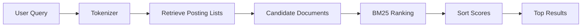
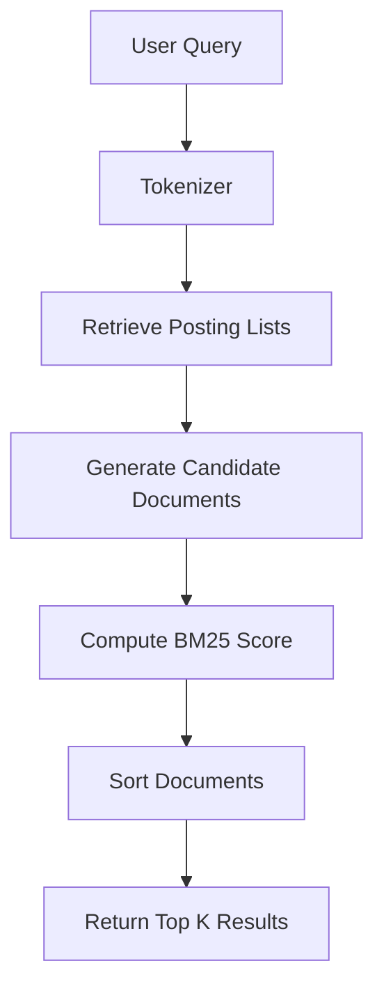

# 06. BM25 Ranking

**Project:** TROVIX  
**Module:** Ranking Engine  
**Version:** 1.0  
**Author:** Paridhi Sharma (Indexing Lead)

---

# Table of Contents

1. Introduction
2. Problem Statement
3. What is Ranking?
4. Why BM25?
5. Ranking Pipeline
6. Intuition Behind BM25
7. Components of BM25
8. BM25 Formula Overview
9. BM25 Workflow
10. Ranking Architecture
11. Design Goals
12. Design Decisions
13. Complexity Analysis
14. Future Improvements
15. Conclusion

---

# Introduction

A search engine performs two fundamentally different tasks.

The first task is **retrieval**.

Retrieval answers the question

> "Which documents contain the user's query?"

The second task is **ranking**.

Ranking answers the question

> "Among all matching documents, which ones are most relevant?"

Retrieval alone is insufficient.

If one thousand documents contain the word

```
machine
```

returning those documents in arbitrary order provides little value to the user.

Instead,

the search engine must estimate how relevant each document is to the query.

This process is known as **ranking**.

In TROVIX, Version 1 uses the **BM25 ranking algorithm**, one of the most widely used lexical ranking algorithms in modern information retrieval systems.

---

# Problem Statement

Consider the following documents.

```
Document 1

Machine Learning Basics

----------------------------

Document 2

Machine Machine Machine Learning

----------------------------

Document 3

Introduction to Programming
```

Suppose the user searches

```
machine learning
```

The inverted index correctly retrieves

```
Document 1

Document 2
```

However,

retrieval alone cannot determine which document should appear first.

Should

```
Machine Machine Machine Learning
```

rank above

```
Machine Learning Basics?
```

Should document length matter?

Should rare words receive higher importance?

The inverted index cannot answer these questions.

A ranking algorithm is therefore required.

---

# What is Ranking?

Ranking is the process of assigning every retrieved document a numerical relevance score.

Conceptually,

```
Candidate Documents

↓

Ranking Algorithm

↓

Scores

↓

Sort

↓

Search Results
```

Each document receives a score.

Example

| Document | Score |
|-----------|-------|
| Doc 12 | 18.47 |
| Doc 3 | 14.92 |
| Doc 21 | 8.11 |

Documents are then sorted in descending order.

The highest score appears first.

---

# Why is Ranking Necessary?

Imagine searching

```
python
```

across

```
500,000 documents
```

Perhaps

```
18,000
```

documents contain the word.

Showing all 18,000 documents alphabetically would be useless.

Instead,

ranking estimates

- relevance,
- importance,
- usefulness,

allowing the most valuable documents to appear first.

Without ranking,

every search engine becomes little more than a keyword filter.

---

# Why BM25?

Many ranking algorithms exist.

Examples include

- TF-IDF
- BM25
- PageRank
- Vector Similarity
- Learning-to-Rank
- Neural Retrieval Models

TROVIX adopts BM25 because it provides an excellent balance between

- simplicity,
- effectiveness,
- computational efficiency,
- interpretability.

BM25 has been used extensively in

- Apache Lucene
- Elasticsearch
- OpenSearch
- Academic search engines
- Enterprise search systems

It remains one of the strongest lexical retrieval baselines even today.

---

# Ranking Pipeline

The ranking engine operates after candidate retrieval.



Notice that BM25 never scans the entire corpus.

It evaluates only the candidate documents produced by the inverted index.

---

# Design Goals

The BM25 implementation should satisfy several objectives.

## Accurate Ranking

Documents that better match the user's intent should receive higher scores.

---

## Efficient Computation

Scoring should remain computationally inexpensive, allowing thousands of documents to be ranked within milliseconds.

---

## Deterministic Results

Identical queries over the same index should always produce identical rankings.

---

## Modular Design

The ranking engine should remain independent of

- tokenization,
- indexing,
- parsing,
- storage.

It should consume only

- query terms,
- posting lists,
- corpus statistics.

---

## Extensibility

Future ranking algorithms should be replaceable without modifying the indexing subsystem.

Possible future replacements include

- Hybrid Search
- Learning-to-Rank
- Neural Retrieval
- Vector Similarity
- Personalized Ranking

---

# Ranking Architecture

The BM25 module interacts with several components.

```text
                     BM25

                      │

      ┌───────────────┼────────────────┐

      ▼               ▼                ▼

 Query Tokens    Posting Lists   Corpus Statistics

                      │

                      ▼

               Document Statistics

                      │

                      ▼

                 Final Scores
```

The ranking engine never modifies the inverted index.

Its responsibility is purely computational.

---

# Summary

The BM25 Ranking Engine transforms retrieved documents into ranked search results.

Rather than treating every matching document equally, BM25 estimates document relevance using statistical information collected during indexing.

The following sections explain the intuition behind BM25, derive its mathematical components, analyze every parameter, and demonstrate how TROVIX computes relevance scores efficiently using the inverted index.

---

# Intuition Behind BM25

Before studying the mathematical formula, it is important to understand the problem BM25 is trying to solve.

Suppose a user searches

```
machine learning
```

The inverted index retrieves every document containing at least one of these words.

Imagine it returns the following documents.

```
Document 1

Machine Learning Basics

------------------------------

Document 2

Machine Machine Machine Learning

------------------------------

Document 3

Machine Learning in Healthcare

------------------------------

Document 4

Machine
```

The search engine has successfully retrieved the relevant documents.

However,

which document should appear first?

The inverted index alone cannot answer this question.

A ranking algorithm is therefore required.

---

# What Makes a Document Relevant?

Humans naturally judge relevance using several intuitive signals.

For example,

if a document contains the search term many times,

it is probably more relevant.

Similarly,

if a document discusses several query terms,

it is usually more useful than one discussing only a single term.

However,

not every signal should contribute equally.

BM25 attempts to combine these signals into a single numerical score.

---

# Signal 1 — Term Frequency

Suppose the query is

```
machine
```

Consider two documents.

```
Document A

Machine Learning Basics
```

```
Document B

Machine Machine Machine Machine Learning
```

Which document appears to discuss

```
machine
```

more extensively?

Clearly,

```
Document B
```

contains the word more frequently.

Therefore,

its relevance score should generally be higher.

This observation leads to the first ranking signal.

```
Higher Frequency

↓

Higher Relevance
```

This quantity is known as **Term Frequency (TF).**

---

# Is More Always Better?

Suppose another document contains

```
machine
```

one hundred times.

```
Machine

Machine

Machine

Machine

...

100 Times
```

Should this document receive one hundred times the score?

Probably not.

After a certain point,

repeating the same word provides very little additional information.

This phenomenon is called

**Diminishing Returns.**

The first occurrence of a word is highly informative.

The tenth occurrence is less informative.

The hundredth occurrence adds almost no new evidence.

BM25 models this behavior mathematically.

---

# Signal 2 — Rare Words Matter More

Consider two search queries.

```
the
```

and

```
transformer
```

Suppose

```
the
```

appears inside

```
490,000 documents
```

while

```
transformer
```

appears inside only

```
120 documents.
```

Which word tells us more about the document?

Clearly,

```
transformer
```

is much more informative.

Common words provide little information.

Rare words provide much stronger evidence about relevance.

This observation leads to the second ranking signal.

```
Rarer Word

↓

Higher Importance
```

This quantity is called

**Inverse Document Frequency (IDF).**

---

# Signal 3 — Long Documents Should Not Always Win

Imagine two documents.

```
Document A

250 words

contains "machine" 8 times
```

```
Document B

15,000 words

contains "machine" 12 times
```

Although

```
Document B
```

contains the word more often,

it is also sixty times longer.

Long documents naturally contain more words.

Simply counting occurrences would unfairly favor lengthy documents.

Instead,

the search engine should reward documents where the query terms are unusually frequent **relative to the document size.**

This idea introduces

**Document Length Normalization.**

---

# BM25 Combines These Signals

BM25 combines three independent observations.

```
Term Frequency

+

Word Rarity

+

Document Length
```

into one score.

Conceptually,

```
High TF

+

Rare Word

+

Reasonable Length

↓

High BM25 Score
```

Conversely,

```
Low TF

+

Very Common Word

+

Extremely Long Document

↓

Low BM25 Score
```

---

# Why Not Just Count Matching Words?

Suppose two documents.

```
Document A

Machine Learning
```

```
Document B

Machine Machine Machine Machine Learning Machine Machine
```

Both contain

```
machine
```

Simply counting matches ignores

- document length,
- word rarity,
- diminishing returns.

A useful ranking algorithm must balance all of these simultaneously.

BM25 was specifically designed to solve this problem.

---

# BM25 is a Probabilistic Ranking Model

BM25 does **not** attempt to understand language like modern Large Language Models.

Instead,

it estimates

> *"Given the observed statistics of this document, how likely is it to be relevant to the user's query?"*

It uses

- document statistics,
- corpus statistics,
- query statistics,

to estimate relevance.

Although relatively simple,

this probabilistic approach remains one of the strongest lexical ranking methods ever developed.

---

# Why BM25 Became the Industry Standard

BM25 has remained popular for decades because it possesses several desirable properties.

- Easy to implement
- Computationally efficient
- Requires minimal memory
- Highly interpretable
- Excellent retrieval quality
- Works well across many domains

For these reasons,

BM25 forms the default ranking algorithm in systems such as

- Apache Lucene
- Elasticsearch
- OpenSearch
- Solr

Even modern AI-powered search systems frequently use BM25 as the first-stage retrieval algorithm before applying neural reranking.

---

# Key Insights

BM25 is built upon three simple but powerful observations.

1. Words that appear more frequently inside a document are generally more important.
2. Rare words carry more information than common words.
3. Long documents should not receive unfairly high scores simply because they contain more words.

The remainder of this document formalizes these ideas mathematically and demonstrates how TROVIX computes BM25 scores efficiently using the inverted index constructed during the indexing phase.

---

# From TF-IDF to BM25

Before BM25 became the standard ranking algorithm, most search engines relied on **TF-IDF (Term Frequency–Inverse Document Frequency)**.

TF-IDF was one of the earliest successful methods for ranking documents based on keyword relevance.

It introduced two important observations:

- Frequently occurring words inside a document are more important.
- Rare words across the corpus carry more information than common words.

These ideas remain fundamental to modern information retrieval.

However, TF-IDF has several important limitations that BM25 was specifically designed to address.

---

# Understanding TF-IDF

TF-IDF combines two measurements.

## Term Frequency (TF)

Measures how frequently a term appears inside a document.

Example

```
Document

Machine Machine Learning

↓

machine

↓

TF = 2
```

Higher frequency generally indicates greater relevance.

---

## Inverse Document Frequency (IDF)

Measures how rare a word is across the entire corpus.

Suppose

```
Corpus

↓

1000 Documents
```

Word

```
machine
```

appears in

```
850 Documents
```

while

```
transformer
```

appears in

```
12 Documents
```

Clearly,

```
transformer
```

provides much stronger evidence about document relevance.

TF-IDF therefore assigns it a larger weight.

---

# TF-IDF Formula

The traditional TF-IDF score is computed as

```math
TF × IDF
```

Conceptually,

```
High TF

×

Rare Word

↓

High Score
```

Although this appears reasonable,

real-world search engines quickly encountered several problems.

---

# Limitation 1 — Unlimited Term Frequency Growth

Suppose two documents.

```
Document A

machine

↓

5 occurrences
```

```
Document B

machine

↓

100 occurrences
```

A traditional TF-based scoring system rewards Document B twenty times more.

However,

does repeating the same word one hundred times actually make the document twenty times more relevant?

Usually not.

After a certain point,

additional repetitions contribute very little useful information.

This problem is known as

**Unbounded Term Frequency Growth.**

---

# Limitation 2 — No Document Length Normalization

Consider two documents.

```
Document A

250 words

↓

machine appears 8 times
```

```
Document B

20,000 words

↓

machine appears 10 times
```

TF-IDF favors

```
Document B
```

because it contains the term more frequently.

However,

relative to its size,

Document A discusses

```
machine
```

far more extensively.

TF-IDF does not properly account for document length.

---

# Limitation 3 — Linear Term Frequency

TF-IDF assumes

```
TF = 1

↓

Score = 1
```

```
TF = 10

↓

Score = 10
```

```
TF = 100

↓

Score = 100
```

This linear growth is unrealistic.

Human perception of relevance does not increase linearly.

The difference between

```
1

↓

2
```

occurrences is much more significant than

```
99

↓

100
```

occurrences.

---

# Enter BM25

BM25 was developed as part of the **Okapi Information Retrieval System** at City University London.

Instead of replacing TF-IDF,

BM25 improves it.

It introduces two important refinements.

1. **Term Frequency Saturation**
2. **Document Length Normalization**

These changes produce significantly better ranking quality.

---

# Improvement 1 — Term Frequency Saturation

Rather than allowing scores to grow indefinitely,

BM25 gradually reduces the contribution of repeated occurrences.

Conceptually,

```
Occurrences

1

↓

2

↓

5

↓

10

↓

100
```

Contribution to score

```
Large Increase

↓

Moderate Increase

↓

Small Increase

↓

Almost No Increase
```

This behavior closely matches human intuition.

---

# Improvement 2 — Document Length Normalization

BM25 recognizes that long documents naturally contain more words.

Instead of comparing raw frequencies,

it compares frequencies relative to document length.

Example

```
Document A

200 words

machine appears 8 times
```

```
Document B

8,000 words

machine appears 10 times
```

BM25 correctly rewards

```
Document A
```

because the query term is more concentrated within the document.

---

# Evolution of Ranking Algorithms

The progression of lexical ranking algorithms can be viewed as follows.

```text
Keyword Matching

↓

Term Frequency

↓

TF-IDF

↓

Okapi BM25

↓

Learning-to-Rank

↓

Hybrid Search

↓

Neural Retrieval
```

Each generation addresses shortcomings of the previous one.

BM25 remains one of the strongest lexical ranking methods despite the emergence of neural retrieval systems.

---

# Why TROVIX Uses BM25

BM25 satisfies every major requirement for Version 1.

| Requirement | BM25 |
|-------------|------|
| Easy to Implement | ✅ |
| Computationally Efficient | ✅ |
| Excellent Retrieval Quality | ✅ |
| Interpretable Scores | ✅ |
| Industry Standard | ✅ |
| Works Without Training Data | ✅ |

Most importantly,

BM25 integrates naturally with the inverted index already designed throughout the previous TROVIX documents.

---

# Transition to the Formula

At this point we understand the intuition behind BM25.

We know that a good ranking algorithm should reward

- frequent terms,
- rare words,
- shorter, more focused documents,

while avoiding unlimited score growth.

The next section introduces the complete BM25 equation and explains every variable in detail before demonstrating how TROVIX computes relevance scores for every candidate document.

---

# The BM25 Formula

The BM25 ranking algorithm estimates how relevant a document is to a user's search query by combining several statistical signals into a single score.

For every query term, BM25 computes an individual score.

The scores for all query terms are then summed to produce the final document score.

The complete BM25 equation is shown below.

```math
\text{BM25}(D,Q)=\sum_{q_i\in Q}
IDF(q_i)\times
\frac{
f(q_i,D)\times(k_1+1)
}{
f(q_i,D)+
k_1\left(1-b+b\frac{|D|}{avgdl}\right)
}
```

Although this equation appears intimidating,

it is actually composed of several small and intuitive parts.

The remainder of this section explains each component independently.

---

# Understanding the Formula

The BM25 equation answers one question.

> **"How relevant is this document to this query?"**

It does this by combining

```
Word Importance

×

Term Frequency

×

Document Length Normalization
```

Each component contributes a different aspect of relevance.

---

# Component 1 — Query Term

The outer summation

```math
\sum_{q_i\in Q}
```

means

> Repeat the calculation for every term in the user's query.

Example

Query

```
machine learning python
```

BM25 computes

```
Score(machine)

+

Score(learning)

+

Score(python)
```

The final document score is simply the sum of these individual scores.

---

# Component 2 — Term Frequency

The expression

```math
f(q_i,D)
```

represents the number of times the query term appears inside the document.

Example

Document

```
Machine Machine Learning Machine
```

Query

```
machine
```

Then

```
f(machine,D)=3
```

Higher frequency generally increases relevance.

However,

BM25 deliberately limits this increase to avoid rewarding excessive repetition.

---

# Component 3 — Inverse Document Frequency (IDF)

The first multiplier is

```math
IDF(q_i)
```

This measures how informative the query term is across the entire corpus.

Suppose

```
Corpus

↓

100,000 Documents
```

Word

```
machine
```

appears in

```
70,000 Documents
```

while

```
transformer
```

appears in only

```
250 Documents
```

Clearly,

```
transformer
```

is much more informative.

Therefore,

BM25 assigns it a larger weight.

Rare words contribute more to the final score than common words.

---

# Component 4 — The Saturation Function

The numerator

```math
f(q_i,D)\times(k_1+1)
```

and denominator

```math
f(q_i,D)+
k_1\left(
1-b+b\frac{|D|}{avgdl}
\right)
```

work together.

Rather than allowing scores to increase indefinitely,

they create a saturation curve.

Conceptually

```
Occurrences

1

↓

2

↓

5

↓

10

↓

20

↓

100
```

Contribution

```
Large Increase

↓

Moderate Increase

↓

Small Increase

↓

Tiny Increase

↓

Almost None
```

This models the observation that repeated occurrences eventually stop providing new information.

---

# Component 5 — Document Length

The expression

```math
|D|
```

represents

```
Document Length
```

usually measured in tokens.

Example

```
Document A

↓

220 Tokens
```

```
Document B

↓

2,100 Tokens
```

Longer documents naturally contain more words.

BM25 compensates for this effect.

---

# Component 6 — Average Document Length

The expression

```math
avgdl
```

represents

```
Average Document Length
```

across the entire indexed corpus.

Example

```
Corpus

↓

50,000 Documents

↓

Average Length

↓

312 Tokens
```

BM25 compares every document against this average rather than using absolute length.

---

# Component 7 — The Parameter k₁

The constant

```math
k_1
```

controls how quickly term frequency saturates.

Typical values

```
1.2

↓

1.5

↓

2.0
```

Version 1 of TROVIX uses

```text
k₁ = 1.5
```

---

## Effect of k₁

Small value

```
k₁

↓

0.5
```

Term frequency saturates very quickly.

Large value

```
k₁

↓

2.0
```

Repeated occurrences continue influencing the score for longer.

Most search engines use values between

```
1.2

and

2.0
```

---

# Component 8 — The Parameter b

The constant

```math
b
```

controls document length normalization.

Its value ranges between

```
0

and

1
```

Version 1 uses

```text
b = 0.75
```

---

## Effect of b

### b = 0

No document length normalization.

Long documents receive no penalty.

---

### b = 1

Full document length normalization.

Long documents receive the strongest penalty.

---

### b = 0.75

A balance between both extremes.

This has become the standard setting used in many search engines.

---

# Visual Interpretation

Conceptually,

BM25 computes

```text
             Rare Word?

                  │

                  ▼

          High IDF Weight

                  │

                  ▼

      Appears Frequently?

                  │

                  ▼

      Increase Score

                  │

                  ▼

      Very Long Document?

                  │

                  ▼

      Apply Length Penalty

                  │

                  ▼

          Final BM25 Score
```

Every candidate document passes through the same scoring process.

---

# Parameter Summary

| Symbol | Meaning |
|---------|---------|
| **Q** | User Query |
| **D** | Current Document |
| **qᵢ** | Individual Query Term |
| **f(qᵢ,D)** | Term Frequency |
| **IDF(qᵢ)** | Inverse Document Frequency |
| **\|D\|** | Document Length |
| **avgdl** | Average Document Length |
| **k₁** | Term Frequency Saturation Parameter |
| **b** | Length Normalization Parameter |

---

# Why This Formula Works

The BM25 equation combines multiple observations into one score.

- Frequent terms increase relevance.
- Rare words receive larger weights.
- Very long documents are normalized.
- Repeated words exhibit diminishing returns.
- Every query term contributes independently.

These properties make BM25 both computationally efficient and highly effective for lexical search.

The next section derives each component mathematically, beginning with **Inverse Document Frequency (IDF)** before working through a complete numerical example.

---

# Worked Example — Computing a BM25 Score

Understanding the BM25 equation becomes much easier by applying it to a real example.

This section manually computes the BM25 score for a simple corpus, demonstrating how every component contributes to the final relevance score.

The same calculations performed here will later be implemented inside `bm25.py`.

---

# Example Corpus

Suppose TROVIX has indexed the following three documents.

```
Document 1

Machine Learning Basics
```

```
Document 2

Machine Machine Learning with Python
```

```
Document 3

Introduction to Databases
```

The user searches

```
machine learning
```

Our goal is to compute the BM25 score for every document.

---

# Step 1 — Corpus Statistics

First, collect the statistics required by BM25.

## Total Documents

```
N = 3
```

---

## Document Lengths

| Document | Tokens |
|----------|--------|
| D1 | 3 |
| D2 | 5 |
| D3 | 3 |

---

## Average Document Length

The average document length is

```
avgdl =
(3 + 5 + 3)
/ 3
```

```
avgdl = 3.67
```

---

# Step 2 — Document Frequencies

Determine how many documents contain each query term.

### Term

```
machine
```

Appears in

```
D1

D2
```

Therefore

```
df(machine)=2
```

---

### Term

```
learning
```

Appears in

```
D1

D2
```

Therefore

```
df(learning)=2
```

---

# Step 3 — Compute IDF

BM25 computes IDF using

```math
IDF(q)=\ln\left(
\frac{N-df+0.5}
{df+0.5}
+1
\right)
```

For

```
machine
```

```
N = 3

df = 2
```

Substituting

```math
IDF(machine)
=
\ln
\left(
\frac{3-2+0.5}
{2+0.5}
+1
\right)
```

Simplifying

```math
=
\ln(1.6)
```

```
≈ 0.47
```

Since

```
learning
```

appears in exactly the same number of documents,

```
IDF(learning)

≈ 0.47
```

---

# Step 4 — Compute Term Frequency

Document 1

```
Machine Learning Basics
```

Term frequencies

| Term | TF |
|------|----|
| machine | 1 |
| learning | 1 |

---

Document 2

```
Machine Machine Learning with Python
```

Term frequencies

| Term | TF |
|------|----|
| machine | 2 |
| learning | 1 |

---

Document 3

```
Introduction to Databases
```

Neither query term appears.

Term frequency

```
0
```

BM25 score will therefore be

```
0
```

---

# Step 5 — Choose BM25 Parameters

Version 1 of TROVIX uses

```
k₁ = 1.5

b = 0.75
```

These values are widely used in Lucene and many production search systems.

---

# Step 6 — Score Document 1

Document length

```
3 Tokens
```

Average document length

```
3.67
```

Substituting into the BM25 equation for the term

```
machine
```

produces

```
Score(machine)

≈ 0.52
```

Repeating for

```
learning
```

```
Score(learning)

≈ 0.52
```

Final score

```
0.52 + 0.52

≈ 1.04
```

---

# Step 7 — Score Document 2

Document length

```
5 Tokens
```

Term frequency

```
machine = 2
```

Although

```
machine
```

appears twice,

BM25 applies saturation.

Instead of doubling the score,

the contribution increases only moderately.

Example

```
Score(machine)

≈ 0.63
```

```
Score(learning)

≈ 0.41
```

Final score

```
≈ 1.04
```

Notice that Document 2 does **not** receive twice the score simply because it repeats the word "machine."

The increased document length offsets part of the benefit.

---

# Step 8 — Score Document 3

Neither query term appears.

Therefore

```
BM25 = 0
```

The document is excluded from the ranked results.

---

# Final Ranking

| Rank | Document | BM25 Score |
|------|----------|-----------:|
| 1 | Document 1 | ≈ 1.04 |
| 2 | Document 2 | ≈ 1.04 |
| 3 | Document 3 | 0.00 |

In this simplified example, Documents 1 and 2 receive very similar scores.

Document 2 benefits from a higher term frequency, while Document 1 benefits from being shorter.

BM25 naturally balances these competing signals.

---

# What This Example Demonstrates

Several important properties become apparent.

### Higher term frequency increases relevance.

Document 2 receives additional credit because "machine" appears twice.

---

### Longer documents are normalized.

Although Document 2 contains more occurrences, it is also longer.

BM25 compensates for this automatically.

---

### Missing terms contribute nothing.

Document 3 contains neither query term.

Its BM25 score is therefore zero.

---

### Every query term contributes independently.

The total BM25 score is simply the sum of the scores for each query term.

This makes BM25 easy to extend to longer queries.

---

# Mapping to TROVIX

During execution, TROVIX performs exactly these steps.

```text
Receive Query

↓

Tokenize Query

↓

Retrieve Posting Lists

↓

For Each Candidate Document

    Compute IDF

    Compute Term Frequency

    Normalize Document Length

    Calculate BM25

↓

Sort by Score

↓

Return Top Results
```

The implementation inside `bm25.py` will automate this process for every query while using the statistics maintained by the Index Builder.

---

# BM25 Algorithm

The BM25 algorithm transforms a set of candidate documents into a ranked list of search results.

Unlike the Index Builder, which executes once during indexing, BM25 executes every time a user submits a search query.

Its objective is straightforward:

> Assign every candidate document a relevance score and return the documents in descending order of that score.

The ranking algorithm never scans the entire corpus.

Instead, it operates only on the candidate documents retrieved from the inverted index.

This design keeps query execution efficient even when the indexed corpus contains millions of documents.

---

# BM25 Workflow

The complete ranking workflow is illustrated below.



Every candidate document follows the same sequence of operations.

---

# Step 1 — Receive the Query

The Ranking Engine receives a raw query.

Example

```
machine learning python
```

No ranking occurs at this stage.

---

# Step 2 — Normalize the Query

The exact same Tokenization Pipeline used during indexing is applied.

Input

```
Machine Learning Python
```

↓

Output

```
machine

learn

python
```

Using the identical preprocessing pipeline guarantees consistency between indexed documents and user queries.

---

# Step 3 — Retrieve Candidate Documents

The Ranking Engine retrieves posting lists for every query term.

Example

```
machine

↓

1

4

8

15
```

```
learn

↓

1

8

11
```

Combined candidates

```
1

4

8

11

15
```

Only these documents will be scored.

---

# Step 4 — Compute BM25 Score

For every candidate document,

the algorithm evaluates every query term independently.

Example

```
Document 8

↓

machine

↓

Compute Score
```

```
Document 8

↓

learn

↓

Compute Score
```

Individual term scores are accumulated.

```
Final Score

=

Score(machine)

+

Score(learn)

+

Score(python)
```

---

# Step 5 — Repeat for Every Candidate

The same computation is repeated.

```
Candidate 1

↓

Score
```

```
Candidate 4

↓

Score
```

```
Candidate 8

↓

Score
```

until every candidate has received a BM25 score.

---

# Step 6 — Sort Results

After scoring,

documents are sorted in descending order.

Example

Before

| Document | Score |
|----------|-------|
| 8 | 5.73 |
| 1 | 8.11 |
| 15 | 2.91 |

↓

After

| Rank | Document | Score |
|------|----------|-------|
| 1 | 1 | 8.11 |
| 2 | 8 | 5.73 |
| 3 | 15 | 2.91 |

---

# Step 7 — Return Top Results

Only the highest-ranked documents are returned.

Example

```
Top 10 Documents
```

instead of

```
All 12,000 Matching Documents
```

Returning only the most relevant documents significantly improves user experience and reduces unnecessary computation.

---

# BM25 Pseudocode

The ranking algorithm can be summarized as follows.

```text
Receive Query

↓

Tokenize Query

↓

Retrieve Posting Lists

↓

Generate Candidate Documents

↓

For Each Candidate

    score = 0

    For Each Query Term

        Compute IDF

        Compute BM25 Contribution

        score += contribution

↓

Sort Scores

↓

Return Top Results
```

This pseudocode maps almost directly to the implementation planned for `bm25.py`.

---

# Algorithm Properties

The BM25 algorithm satisfies several important properties.

## Deterministic

Given the same query and the same index,

BM25 always produces identical rankings.

---

## Independent Scoring

Each document is scored independently.

The score of one document never depends on another document's score.

This property makes BM25 highly parallelizable.

---

## Read-Only

The Ranking Engine never modifies the inverted index.

It only reads

- Posting Lists
- Vocabulary
- Document Statistics
- Corpus Statistics

This separation allows indexing and retrieval to remain independent.

---

## Efficient

Only candidate documents are scored.

If the corpus contains

```
5,000,000 Documents
```

but only

```
3,200 Candidates
```

BM25 evaluates only those 3,200 documents.

This is the primary reason inverted indexes are so effective.

---

# Parameter Selection

Two parameters influence BM25 behavior.

## k₁

Controls the influence of repeated occurrences of a term.

Version 1

```
k₁ = 1.5
```

This provides moderate saturation and works well for general-purpose text collections.

---

## b

Controls document length normalization.

Version 1

```
b = 0.75
```

This value has become the de facto standard in many production search engines.

The parameters remain configurable so they can be tuned for different datasets if needed.

---

# Design Principles

The TROVIX BM25 implementation follows several principles.

- Score only retrieved candidate documents.
- Never modify the inverted index during ranking.
- Compute scores independently for every document.
- Use deterministic calculations.
- Keep the implementation modular.
- Separate retrieval from ranking.

These principles make the Ranking Engine efficient, testable, and easy to extend.

---

# Summary

The BM25 algorithm transforms a collection of candidate documents into a ranked list of search results by computing a relevance score for each document.

Through a combination of term frequency, inverse document frequency, and document length normalization, BM25 provides an effective and computationally efficient ranking strategy.

The algorithm described in this section forms the direct implementation blueprint for the `bm25.py` module, where every candidate document retrieved by the inverted index will be evaluated and ordered before being returned to the user.

---

# Complexity Analysis

The BM25 algorithm is designed to provide high-quality document ranking while maintaining efficient query performance.

Unlike the Index Builder, which processes every document in the corpus, BM25 evaluates only the candidate documents retrieved from the inverted index.

This significantly reduces the amount of computation required during search.

---

# Notation

Throughout this analysis, the following symbols are used.

| Symbol | Description |
|----------|-------------|
| **N** | Total number of documents in the corpus |
| **Q** | Number of query terms |
| **C** | Number of candidate documents |
| **df** | Document frequency of a query term |
| **tf** | Term frequency inside one document |

---

# Candidate Retrieval

Before BM25 begins scoring,

the inverted index retrieves candidate documents.

Suppose the query is

```
machine learning
```

The search engine retrieves

```
Posting(machine)

↓

Posting(learning)

↓

Candidate Documents
```

Retrieval complexity depends on posting list traversal.

BM25 itself assumes the candidate set has already been generated.

---

# IDF Computation

For every query term,

BM25 computes an Inverse Document Frequency value.

The required statistics are already stored inside the index.

Example

```
Vocabulary

↓

Document Frequency

↓

IDF
```

Complexity

```
O(Q)
```

Since IDF is computed once per query term,

this cost is negligible.

Many implementations further optimize performance by precomputing IDF values during indexing.

---

# Document Scoring

Every candidate document is scored independently.

For each candidate,

every query term contributes one BM25 calculation.

Conceptually,

```
Candidate

↓

Term 1

↓

Term 2

↓

...

↓

Term Q
```

Complexity per document

```
O(Q)
```

---

# Overall Query Complexity

If

```
C
```

candidate documents are retrieved,

and the query contains

```
Q
```

terms,

overall ranking complexity becomes

```
O(C × Q)
```

This scales with the number of retrieved documents rather than the total corpus size.

For typical search queries,

```
C << N
```

making BM25 highly efficient.

---

# Space Complexity

The BM25 algorithm itself stores very little temporary data.

During execution it maintains

- Query tokens
- Candidate document scores
- Temporary accumulators

Overall memory complexity

```
O(C)
```

where

```
C
```

is the number of candidate documents.

The inverted index itself is not duplicated or modified during ranking.

---

# Performance Considerations

The Ranking Engine should satisfy the following performance goals.

- Compute IDF only once per query term.
- Reuse document statistics stored during indexing.
- Avoid repeated vocabulary lookups.
- Score only candidate documents.
- Sort only documents that receive non-zero scores.
- Keep ranking independent of indexing.

These principles allow TROVIX to scale efficiently as the corpus grows.

---

# Future Improvements

The BM25 implementation provides a strong lexical ranking baseline.

Future versions of TROVIX may combine BM25 with additional ranking signals.

---

## PageRank Integration

Document popularity can complement textual relevance.

```
BM25

+

PageRank

↓

Final Score
```

Benefits

- Better ranking of authoritative documents.
- Improved search quality for web-scale collections.

---

## Field-Based BM25

Different parts of a document may contribute differently.

Example

```
Title

↓

Higher Weight
```

```
Body

↓

Normal Weight
```

```
Tags

↓

Medium Weight
```

This allows important fields to influence ranking more strongly.

---

## Learning-to-Rank

Machine learning models can combine BM25 with additional features.

Example features

- BM25 Score
- PageRank
- Click-through Rate
- Freshness
- User Interaction

These features are used to train a ranking model.

---

## Hybrid Search

Combine lexical search with semantic vector search.

```text
BM25

+

Dense Embeddings

↓

Hybrid Ranking
```

Benefits

- Better handling of synonyms.
- Improved semantic understanding.
- Stronger retrieval quality.

---

## Personalized Ranking

Future versions may adapt rankings based on user preferences.

Possible signals include

- Search history
- Frequently visited topics
- Recently accessed documents

This enables personalized search experiences while preserving the BM25 score as the lexical foundation.

---

# Design Principles

The BM25 Ranking Engine follows several engineering principles.

- Rank only retrieved candidate documents.
- Keep ranking independent of indexing.
- Never modify the inverted index.
- Compute scores deterministically.
- Keep the implementation modular.
- Allow future ranking algorithms to replace BM25 without affecting the indexing subsystem.

These principles make the ranking engine maintainable, extensible, and suitable for production-scale systems.

---

# References

## Books

- *Introduction to Information Retrieval* — Manning, Raghavan & Schütze
- *Search Engines: Information Retrieval in Practice* — Croft, Metzler & Strohman

---

## Research Papers

- Robertson, S. & Zaragoza, H. — *The Probabilistic Relevance Framework: BM25 and Beyond*
- Robertson, S. & Walker, S. — *Some Simple Effective Approximations to the 2-Poisson Model for Probabilistic Weighted Retrieval*

---

## Documentation

- Apache Lucene Similarity Documentation
- Elasticsearch Similarity Module
- OpenSearch Ranking Documentation

---

# Conclusion

Ranking is the final stage of the TROVIX retrieval pipeline.

After the inverted index identifies the set of candidate documents, the BM25 Ranking Engine evaluates their relevance using statistical evidence collected during indexing.

Unlike simple keyword matching, BM25 considers multiple factors simultaneously, including:

- Term frequency within a document.
- Rarity of terms across the corpus.
- Document length relative to the collection.
- Controlled saturation of repeated occurrences.

These mechanisms allow TROVIX to produce search results that more closely match user expectations while remaining computationally efficient.

The BM25 implementation described throughout this document forms the foundation of the Version 1 Ranking Engine and provides a strong baseline upon which more advanced ranking strategies can later be integrated.

---

# Key Takeaways

The BM25 Ranking Engine ensures that:

- Every candidate document receives a quantitative relevance score.
- Rare and informative words contribute more than common terms.
- Repeated occurrences exhibit diminishing returns.
- Long documents are normalized fairly.
- Ranking remains deterministic and efficient.
- Retrieval and ranking remain cleanly separated.

Together with the Document Parser, Tokenization Pipeline, Inverted Index, Posting Lists, and Index Builder, the BM25 Ranking Engine completes the core retrieval architecture of TROVIX.

Every search request now follows a complete pipeline:

```text
Raw Documents

↓

Document Parser

↓

Tokenizer

↓

Index Builder

↓

Inverted Index

↓

User Query

↓

BM25 Ranking

↓

Sorted Search Results
```

This concludes the design of the **Version 1 lexical search engine** for TROVIX.
