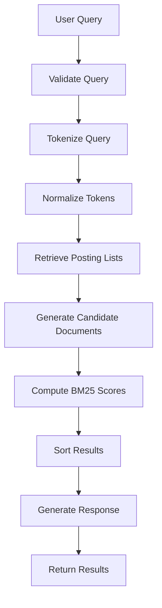
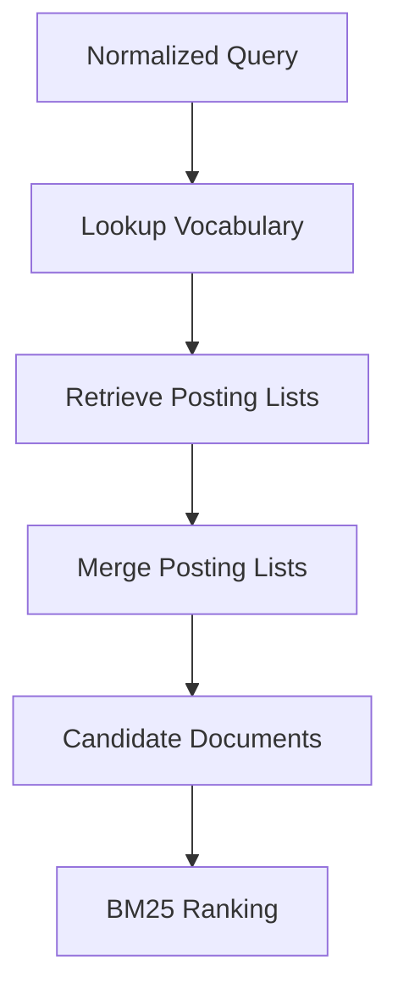
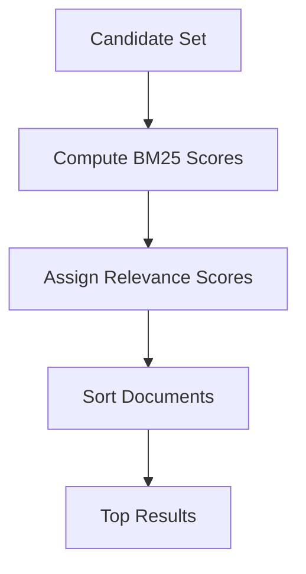

# 07. Query Execution Pipeline

**Project:** TROVIX  
**Module:** Search Engine  
**Version:** 1.0  
**Author:** Paridhi Sharma (Indexing Lead)

---

# Table of Contents

1. Introduction
2. Problem Statement
3. Search Request Lifecycle
4. Query Execution Architecture
5. Query Processing Pipeline
6. Query Parsing
7. Query Tokenization
8. Candidate Retrieval
9. BM25 Ranking
10. Result Sorting
11. Response Generation
12. Error Handling
13. Complexity Analysis
14. Future Improvements
15. Conclusion

---

# Introduction

The Query Execution Pipeline is responsible for transforming a user's search request into a ranked list of relevant documents.

While the indexing pipeline prepares documents for retrieval offline, the query execution pipeline operates entirely online, executing every time a user submits a search request.

Its primary objective is to locate the most relevant documents quickly while minimizing computational overhead.

Unlike indexing, which processes every document in the corpus, query execution examines only the subset of documents that are likely to satisfy the user's request.

This distinction allows TROVIX to deliver search results within milliseconds, even when indexing large document collections.

---

# Problem Statement

After the indexing process has completed, TROVIX possesses

- an inverted index,
- posting lists,
- vocabulary,
- document statistics,
- BM25 ranking logic.

However, none of these components independently answer a user's search request.

Suppose a user enters

```
machine learning python
```

The search engine must determine

- how to interpret the query,
- how to normalize the text,
- which posting lists to retrieve,
- which documents should be scored,
- how to rank those documents,
- which results should be returned.

Executing these steps manually for every search would be inefficient and error-prone.

The Query Execution Pipeline provides a standardized workflow that coordinates every subsystem within TROVIX.

---

# Search Request Lifecycle

Every search request follows the same sequence of operations.


Every stage performs a single responsibility and passes structured data to the next component.

This modular design simplifies debugging, testing, and future enhancements.

---

# Why Separate Query Execution?

Although indexing and retrieval operate on the same data structures, they solve fundamentally different problems.

Indexing answers

> "How should documents be organized?"

Query execution answers

> "How should documents be retrieved?"

Keeping these responsibilities separate offers several advantages.

- The index is built once but queried many times.
- Query execution remains read-only.
- Multiple users can search simultaneously.
- Ranking algorithms can evolve independently from indexing.

This separation follows the Single Responsibility Principle and forms the basis of scalable search engine architecture.

---

# Query Execution Architecture

The Query Execution Pipeline coordinates multiple subsystems.

```text
                   Query Execution

                          │

        ┌─────────────────┼──────────────────┐

        ▼                 ▼                  ▼

 Query Parser       Tokenizer        Inverted Index

                          │

                          ▼

                  Candidate Documents

                          │

                          ▼

                      BM25 Ranking

                          │

                          ▼

                     Search Results
```

Each component communicates through well-defined interfaces.

No component directly depends on the internal implementation of another.

---

# Design Goals

The Query Execution Pipeline has been designed with the following objectives.

## Low Latency

Queries should execute within milliseconds.

---

## High Relevance

Results should be ranked according to their estimated relevance rather than simple keyword matching.

---

## Deterministic Behavior

The same query executed against the same index should always return identical results.

---

## Scalability

Performance should remain stable as the corpus grows from thousands to millions of documents.

---

## Modularity

Each stage of the pipeline should be independently testable and replaceable.

---

# Summary

The Query Execution Pipeline is the runtime component of the TROVIX search engine.

It coordinates parsing, tokenization, candidate retrieval, ranking, and response generation to transform a raw user query into a ranked list of search results.

The following sections describe each stage of this pipeline in detail, beginning with query parsing and normalization before progressing through retrieval, ranking, and response generation.

---

# Query Processing Pipeline

Every search request submitted to TROVIX follows the same deterministic processing pipeline.

Unlike indexing, which is performed offline, query processing occurs in real time.

The objective is to transform a raw user query into a ranked list of relevant documents while minimizing latency.

Every stage of the pipeline performs exactly one responsibility before passing structured data to the next stage.

---

# Complete Query Workflow



Each stage is independent, making the pipeline modular and easy to extend.

---

# Step 1 — Receive the Query

The search process begins when the user submits a search string.

Example

```
Machine Learning Python
```

At this stage,

the query is simply raw text.

No processing has occurred.

---

# Step 2 — Validate the Query

Before performing any computation,

the search engine validates the input.

Validation includes

- Query is not empty.
- Query length is within limits.
- Query encoding is valid.
- Query contains searchable characters.

Examples

Valid

```
machine learning
```

Invalid

```

```

If validation fails,

the search engine immediately returns an empty response instead of executing unnecessary operations.

---

# Step 3 — Tokenize the Query

The exact same tokenizer used during indexing is applied to the query.

Input

```
Machine Learning with Python!
```

↓

Lowercase

↓

```
machine learning with python!
```

↓

Remove punctuation

↓

```
machine learning with python
```

↓

Remove stopwords

↓

```
machine

learning

python
```

↓

Stem

↓

```
machin

learn

python
```

Using the identical preprocessing pipeline guarantees that indexed documents and user queries use the same normalized vocabulary.

---

# Why Use the Same Tokenizer?

Suppose documents were indexed using stemming.

```
running

↓

run
```

If the query is **not** stemmed,

```
running
```

would never match

```
run
```

The tokenizer must therefore behave identically during indexing and querying.

This principle is known as

**Processing Symmetry**.

---

# Step 4 — Remove Duplicate Query Terms

Users sometimes repeat words.

Example

```
machine machine machine learning
```

For ranking,

multiple occurrences of the same query term usually provide little additional benefit.

The normalized query becomes

```
machine

learning
```

Removing duplicates reduces unnecessary BM25 computations while preserving query intent.

---

# Step 5 — Query Representation

Internally,

the search engine converts the processed query into a structured representation.

Example

```python
Query(

    original="Machine Learning",

    tokens=[

        "machin",

        "learn"

    ]
)
```

Representing queries as objects keeps the search engine modular and simplifies future enhancements such as filters, phrase queries, and Boolean operators.

---

# Query Object Design

Version 1 of TROVIX uses a lightweight query representation.

```python
class Query:

    text: str

    tokens: list[str]
```

Future versions may additionally include

- Filters
- Language
- User ID
- Timestamp
- Query Type
- Session Metadata

The parser and ranking engine communicate exclusively through this standardized object.

---

# Design Principles

The query processing stage follows several important principles.

## Stateless

Each query is processed independently.

No information from previous queries influences the current one.

---

## Deterministic

The same query should always produce the same normalized tokens.

---

## Lightweight

Only the minimum amount of processing required for retrieval should occur.

Expensive operations such as ranking are deferred until candidate documents have been identified.

---

## Reusable

The tokenizer used during indexing and querying must always remain identical.

This guarantees consistent vocabulary usage across the search engine.

---

# Summary

The Query Processing Pipeline converts raw user input into a standardized query representation suitable for retrieval.

Through validation, normalization, tokenization, and query object construction, TROVIX prepares the search request for efficient candidate retrieval using the inverted index.

The next stage retrieves the posting lists corresponding to each query term and generates the set of candidate documents that will later be ranked using BM25.

---

# Candidate Retrieval

After the query has been parsed and normalized, the next objective is to identify the subset of documents that are eligible for ranking.

Searching every document in the corpus would be computationally expensive.

Instead, TROVIX leverages the inverted index to retrieve only those documents that contain one or more query terms.

This process is known as **Candidate Retrieval**.

Candidate retrieval is one of the most important optimizations in Information Retrieval because it reduces the search space from millions of documents to only a small set of potentially relevant documents.

---

# Why Candidate Retrieval?

Suppose TROVIX indexes

```
5,000,000 Documents
```

A user searches

```
machine learning
```

Scanning every document would require

```
5,000,000 comparisons
```

for every query.

Instead,

the inverted index immediately returns only documents containing the requested terms.

Example

```
Vocabulary

↓

machine

↓

Posting List

↓

12

58

204

310

811
```

Only these documents are considered for ranking.

This dramatically reduces query latency.

---

# Candidate Retrieval Workflow



The retrieval stage never computes relevance scores.

Its responsibility is only to identify **which documents should be scored.**

---

# Step 1 — Vocabulary Lookup

Each query token is searched inside the vocabulary.

Example

Query

```
machine

learning
```

Vocabulary

```python
vocabulary["machine"]

vocabulary["learning"]
```

If the term exists,

the associated posting list is returned.

If the term does not exist,

an empty posting list is returned.

The search engine never throws an error simply because a term is unknown.

---

# Step 2 — Retrieve Posting Lists

Suppose the vocabulary contains

```
machine

↓

[1, 4, 8, 19]
```

```
learning

↓

[1, 8, 15]
```

These posting lists become the input for candidate generation.

Each posting already contains

- Document ID
- Term Frequency

No document contents need to be loaded.

---

# Step 3 — Merge Posting Lists

For multi-term queries,

multiple posting lists must be combined.

Example

Query

```
machine learning
```

Posting Lists

```
machine

↓

1

4

8

19
```

```
learning

↓

1

8

15
```

Merged Candidates

```
1

4

8

15

19
```

Duplicate document IDs are removed automatically.

Every candidate document appears only once.

---

# OR Retrieval

Version 1 of TROVIX performs **OR-based retrieval**.

This means

> A document becomes a candidate if it contains at least one query term.

Example

Query

```
machine learning
```

Documents

| Document | Contains machine | Contains learning | Candidate |
|-----------|------------------|-------------------|-----------|
| D1 | ✅ | ✅ | ✅ |
| D2 | ✅ | ❌ | ✅ |
| D3 | ❌ | ✅ | ✅ |
| D4 | ❌ | ❌ | ❌ |

This approach maximizes recall.

BM25 later determines which candidates are most relevant.

---

# Why Not AND Retrieval?

An alternative approach would require every query term to appear.

Example

```
machine AND learning
```

Only documents containing **both** terms would be retrieved.

Although this increases precision,

it may exclude many useful documents.

For Version 1,

OR retrieval provides a better balance between recall and ranking quality.

Future versions may support configurable Boolean operators.

---

# Candidate Set Representation

Internally,

candidate documents are represented as a collection of unique document identifiers.

Example

```python
CandidateSet(

    documents={

        1,

        4,

        8,

        15,

        19

    }

)
```

No ranking information is stored at this stage.

The Candidate Set simply identifies which documents should be evaluated.

---

# Posting List Traversal

Posting lists are traversed sequentially.

Example

```
Posting List

↓

Document 1

↓

Document 4

↓

Document 8

↓

Document 19
```

Since posting lists are maintained in sorted order,

future implementations can efficiently support

- Boolean AND
- Boolean OR
- Boolean NOT
- Skip pointers
- Positional queries

without redesigning the underlying data structures.

---

# Candidate Retrieval Algorithm

The retrieval process can be summarized as follows.

```text
Receive Query Tokens

↓

For Each Token

    Lookup Vocabulary

    Retrieve Posting List

Merge Posting Lists

Remove Duplicate Documents

Return Candidate Set
```

Notice that

no document scoring occurs here.

Ranking begins only after the candidate set has been constructed.

---

# Performance Considerations

Candidate retrieval should satisfy several performance goals.

- Vocabulary lookup should remain O(1) on average.
- Posting lists should remain sorted.
- Duplicate document IDs should never exist.
- Only candidate documents should proceed to ranking.
- The inverted index must remain read-only during retrieval.

These principles keep search latency low while maintaining correctness.

---

# Design Principles

The Candidate Retrieval stage follows several architectural principles.

- Retrieve before ranking.
- Never scan the entire corpus.
- Keep retrieval independent of scoring.
- Return unique candidate documents.
- Treat missing query terms gracefully.
- Preserve deterministic behavior.

Separating retrieval from ranking makes the search engine modular and allows different ranking algorithms to reuse the same retrieval subsystem.

---

# Summary

Candidate Retrieval is the stage that transforms normalized query tokens into a compact set of documents eligible for ranking.

By leveraging the inverted index, TROVIX avoids expensive corpus-wide scans and instead retrieves only documents containing one or more query terms.

The resulting Candidate Set becomes the direct input to the BM25 Ranking Engine, which computes relevance scores and orders the final search results.

---

# BM25 Integration

Once the Candidate Set has been generated, TROVIX must determine which documents are most relevant to the user's query.

The Candidate Retrieval stage identifies

> Which documents should be considered.

The BM25 Ranking Engine determines

> In what order those documents should appear.

This separation of responsibilities allows retrieval and ranking to evolve independently while remaining tightly integrated during query execution.

---

# Ranking Workflow

The ranking stage begins immediately after candidate generation.



Every candidate document receives a numerical relevance score.

Higher scores indicate stronger estimated relevance.

---

# Input to BM25

The Ranking Engine requires several inputs.

## Query Tokens

Example

```python
[
    "machine",
    "learn",
    "python"
]
```

---

## Candidate Documents

Example

```python
{
    1,
    4,
    8,
    15,
    19
}
```

---

## Posting Lists

Example

```python
machine

↓

[
    Posting(1,2),

    Posting(8,4),

    Posting(19,1)
]
```

---

## Document Statistics

Example

```python
document_lengths = {

    1: 243,

    8: 391,

    19: 128

}
```

---

## Corpus Statistics

Example

```python
total_documents = 50000

average_document_length = 312
```

These values were generated during indexing and remain read-only during query execution.

---

# Candidate Scoring

For every candidate document,

BM25 evaluates each query term independently.

Example

Query

```
machine learning
```

Candidate

```
Document 8
```

Compute

```text
Score(machine)

+

Score(learning)

=

Final Score
```

This process is repeated for every candidate document.

---

# Score Accumulation

The Ranking Engine maintains a score accumulator.

Example

```python
scores = {

    1: 0.0,

    4: 0.0,

    8: 0.0

}
```

As BM25 contributions are computed,

scores are updated.

Example

```python
scores[8] += 2.13

scores[8] += 1.84
```

Final

```python
scores[8] = 3.97
```

---

# Ranking Algorithm

Conceptually,

the scoring process follows this workflow.

```text
For Each Candidate

    score = 0

    For Each Query Term

        Compute BM25 Contribution

        score += contribution

Store Final Score
```

The result is a mapping between document identifiers and relevance scores.

---

# Result Sorting

After scoring completes,

documents are sorted in descending order.

Example

Before Sorting

| Document | Score |
|----------|--------|
| 8 | 4.12 |
| 1 | 7.91 |
| 15 | 2.04 |

After Sorting

| Rank | Document | Score |
|-------|----------|--------|
| 1 | 1 | 7.91 |
| 2 | 8 | 4.12 |
| 3 | 15 | 2.04 |

The highest scoring document becomes the top search result.

---

# Tie Breaking

Occasionally,

multiple documents may receive identical BM25 scores.

Example

| Document | Score |
|----------|--------|
| 8 | 3.11 |
| 15 | 3.11 |

To ensure deterministic behavior,

TROVIX applies tie-breaking rules.

Version 1 uses

```text
Higher BM25 Score

↓

Lower Document ID
```

This guarantees consistent rankings across repeated executions.

---

# Top-K Retrieval

Users rarely need every matching document.

Suppose

```
18,000 Documents
```

match a query.

Returning all results is inefficient.

Instead,

TROVIX returns only the highest ranked documents.

Example

```python
TOP_K = 10
```

Workflow

```text
Rank Documents

↓

Sort Scores

↓

Return Top 10
```

This significantly improves response times and user experience.

---

# Result Object

The Ranking Engine produces structured results.

Example

```python
SearchResult(

    document_id=17,

    score=8.41
)
```

Multiple results are returned as a ranked collection.

```python
[
    SearchResult(...),

    SearchResult(...),

    SearchResult(...)
]
```

These objects are later transformed into the final user response.

---

# Response Generation

The final stage of query execution converts ranked results into a format suitable for display.

Example

```python
SearchResponse(

    query="machine learning",

    total_results=245,

    results=[...]

)
```

Version 1 includes

- Document ID
- Relevance Score

Future versions may additionally include

- Title
- Snippet
- URL
- Author
- Last Modified Date

---

# Query Execution Algorithm

The complete retrieval and ranking process can be summarized as follows.

```text
Receive Query

↓

Validate Query

↓

Tokenize Query

↓

Lookup Vocabulary

↓

Retrieve Posting Lists

↓

Generate Candidate Set

↓

Compute BM25 Scores

↓

Sort Results

↓

Select Top K

↓

Generate Response

↓

Return Results
```

This algorithm represents the complete search execution lifecycle inside TROVIX.

---

# Design Principles

The ranking integration layer follows several principles.

- Retrieval and ranking remain separate.
- BM25 never modifies the index.
- Candidate documents are scored independently.
- Sorting occurs only after scoring completes.
- Results remain deterministic.
- Only the most relevant documents are returned.

These principles ensure scalability, maintainability, and predictable behavior.

---

# Summary

The BM25 Integration stage transforms candidate documents into ranked search results by assigning relevance scores and ordering documents according to their estimated usefulness.

Together with Candidate Retrieval, it completes the core execution path of the TROVIX search engine, enabling efficient and high-quality document retrieval from large collections.

---

# Error Handling

A search engine must continue operating reliably even when queries are invalid or unexpected situations occur.

Unlike indexing, which may process thousands of documents over several minutes, query execution happens in real time.

Any failure directly affects the user's experience.

Therefore, the Query Execution Pipeline must detect errors early, recover gracefully whenever possible, and always return a valid response.

---

# Error Handling Philosophy

TROVIX follows three principles.

1. Validate inputs before processing.
2. Never expose internal implementation details.
3. Return meaningful responses whenever recovery is possible.

The search engine should fail gracefully instead of terminating unexpectedly.

---

# Types of Query Errors

Errors generally fall into the following categories.

```text
                Query Errors

                      │

      ┌───────────────┼───────────────┐

      ▼               ▼               ▼

 Invalid Input   Missing Terms   Internal Errors

                      │

      ┌───────────────┼───────────────┐

      ▼                               ▼

 Empty Results                 Runtime Exceptions
```

Each category is handled differently.

---

# Empty Query

Example

```

```

There are no searchable terms.

Instead of executing the retrieval pipeline,

the search engine immediately returns an empty response.

Example

```python
SearchResponse(

    query="",

    total_results=0,

    results=[]
)
```

---

# Unknown Query Terms

Suppose the user searches

```
quantumteleportation
```

The vocabulary does not contain this term.

Instead of throwing an error,

the vocabulary lookup returns

```
Empty Posting List
```

The candidate set becomes empty,

and the search engine returns

```python
SearchResponse(

    query="quantumteleportation",

    total_results=0,

    results=[]
)
```

This is considered a valid search rather than an exceptional condition.

---

# Empty Candidate Set

Sometimes every query term is valid,

but no documents satisfy the query.

Example

```
machine biology astronomy
```

↓

No matching documents.

Instead of reporting an error,

the ranking stage is skipped.

The response simply contains zero results.

---

# Invalid Characters

Queries may contain unsupported characters.

Example

```
@@@@####
```

After normalization,

no searchable tokens remain.

The response becomes

```
No Results
```

rather than an application failure.

---

# Internal Exceptions

Unexpected failures may occur during execution.

Examples include

- Memory exhaustion
- Corrupted index
- Missing statistics
- Invalid posting lists
- Software bugs

These exceptions should be logged internally while returning a generic error response to the user.

Sensitive implementation details should never be exposed.

---

# Logging

Every unexpected failure should generate structured logs.

Example

```
ERROR

Timestamp:
2026-07-20 14:51:32

Query:
machine learning

Stage:
BM25 Ranking

Reason:
Missing Document Statistics
```

Structured logging simplifies debugging and operational monitoring.

---

# Recovery Strategy

Whenever possible,

the pipeline continues execution.

Example

```
Query

↓

One Unknown Term

↓

Ignore Missing Posting List

↓

Continue Ranking Remaining Terms
```

The search engine should maximize successful query execution instead of failing because of one missing component.

---

# Complexity Analysis

The Query Execution Pipeline is designed for low-latency execution.

Unlike indexing,

which processes the entire corpus,

query execution examines only candidate documents.

---

# Notation

| Symbol | Description |
|----------|-------------|
| **Q** | Number of query terms |
| **P** | Total size of retrieved posting lists |
| **C** | Number of candidate documents |
| **K** | Number of returned results |

---

# Query Validation

Validation includes

- Empty check
- Encoding validation
- Length validation

Complexity

```
O(1)
```

---

# Query Tokenization

The tokenizer performs a linear scan of the query.

Complexity

```
O(L)
```

where

```
L
```

is the query length.

Since user queries are typically short,

this cost is negligible.

---

# Vocabulary Lookup

Each query term requires one dictionary lookup.

Complexity

```
O(Q)
```

Average-case dictionary access remains constant.

---

# Candidate Retrieval

Retrieving posting lists requires traversing matching postings.

Complexity

```
O(P)
```

where

```
P
```

is the combined size of retrieved posting lists.

---

# BM25 Ranking

Every candidate document is evaluated independently.

Complexity

```
O(C × Q)
```

where

```
C
```

represents the number of candidate documents.

---

# Result Sorting

After scoring,

documents are sorted.

Complexity

```
O(C log C)
```

If only the Top-K results are required,

future implementations may use partial sorting algorithms to reduce computational cost.

---

# Overall Complexity

The complete query execution pipeline requires

```text
Validation

+

Tokenization

+

Vocabulary Lookup

+

Candidate Retrieval

+

BM25 Ranking

+

Sorting
```

Overall complexity

```
O(L + P + C × Q + C log C)
```

In practice,

candidate retrieval and BM25 scoring dominate execution time.

---

# Performance Targets

Version 1 of TROVIX targets the following performance metrics.

| Metric | Target |
|----------|--------|
| Query Latency | < 10 ms |
| Indexed Documents | 50,000+ |
| Vocabulary Lookup | O(1) |
| Candidate Retrieval | O(P) |
| Ranking | O(C × Q) |
| Top Results Returned | 10 |

These targets provide a practical baseline for future optimization.

---

# Future Improvements

Although Version 1 provides a complete lexical retrieval pipeline, several enhancements are planned.

---

## Boolean Queries

Support

```
AND

OR

NOT
```

operators for more expressive searches.

---

## Phrase Search

Support exact phrase matching.

Example

```
"machine learning"
```

instead of treating the terms independently.

---

## Fuzzy Search

Automatically retrieve documents containing similar spellings.

Example

```
machne

↓

machine
```

---

## Autocomplete

Generate query suggestions while the user types.

Example

```
mach

↓

machine learning

machine learning tutorial

machine learning python
```

---

## Query Caching

Frequently executed queries can be cached.

```
Repeated Query

↓

Cache

↓

Instant Response
```

This significantly reduces average query latency.

---

## Hybrid Search

Combine lexical retrieval with semantic vector search.

```
BM25

+

Vector Similarity

↓

Hybrid Ranking
```

This improves retrieval for synonym-rich and natural language queries.

---

## Learning-to-Rank

Future ranking models may combine

- BM25
- PageRank
- Click-through Rate
- User Behavior
- Freshness

to produce more personalized rankings.

---

# References

## Books

- *Introduction to Information Retrieval* — Manning, Raghavan & Schütze
- *Search Engines: Information Retrieval in Practice* — Croft, Metzler & Strohman

---

## Documentation

- Apache Lucene Query Processing
- Elasticsearch Search API
- OpenSearch Query DSL

---

# Conclusion

The Query Execution Pipeline is the runtime backbone of TROVIX.

It transforms a raw user query into a ranked list of relevant documents through a sequence of deterministic stages including validation, tokenization, candidate retrieval, BM25 scoring, sorting, and response generation.

Unlike indexing, which prepares the corpus offline, query execution operates under strict latency constraints while maintaining retrieval quality and system reliability.

The architecture emphasizes modularity, allowing each stage to evolve independently without affecting the overall search workflow.

---

# Key Takeaways

The Query Execution Pipeline ensures that:

- Every query follows a deterministic execution path.
- The same preprocessing pipeline is used for indexing and querying.
- Only candidate documents are ranked.
- BM25 operates independently of retrieval.
- The search engine remains responsive even for large corpora.
- Errors are handled gracefully without exposing internal implementation details.

Together with the indexing and ranking components documented previously, this completes the **end-to-end lexical search architecture** of TROVIX.