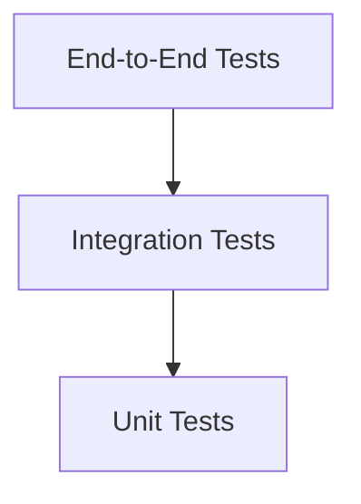

# 01. Testing Strategy

**Project:** TROVIX  
**Module:** Testing & Validation  
**Version:** 1.0  
**Author:** Paridhi Sharma (Indexing Lead)

---

# Table of Contents

1. Introduction
2. Why Testing Matters
3. Testing Objectives
4. Testing Pyramid
5. Testing Architecture
6. Types of Testing
7. Testing Workflow
8. Test Dataset Design
9. Success Criteria
10. Future Improvements
11. Conclusion

---

# Introduction

Testing is an essential component of every software system.

Regardless of how well a system is designed, implementation errors, incorrect assumptions, and unexpected edge cases can lead to incorrect behavior.

For a search engine, these failures may appear as

- Missing search results
- Incorrect document rankings
- Duplicate documents
- Poor query performance
- Corrupted indexes

The purpose of the TROVIX testing strategy is to ensure that every subsystem behaves correctly, consistently, and efficiently before deployment.

Testing is treated as an integral part of the development lifecycle rather than a final verification step.

---

# Why Testing Matters

Search engines consist of many independent components that interact closely.

These include

- Document Parser
- Tokenization Pipeline
- Index Builder
- Inverted Index
- BM25 Ranking Engine
- Query Execution Pipeline

An error in any one of these components can propagate throughout the system and affect every search request.

For example,

```
Incorrect Tokenization

↓

Incorrect Vocabulary

↓

Incorrect Posting Lists

↓

Incorrect BM25 Scores

↓

Poor Search Results
```

Testing helps identify these failures before they impact users.

---

# Testing Objectives

The testing strategy has four primary objectives.

## Correctness

Every module should produce the expected output for valid input.

Example

```
Input

↓

Tokenizer

↓

Expected Tokens
```

---

## Reliability

The search engine should continue operating correctly under unexpected conditions.

Examples include

- Empty documents
- Invalid queries
- Missing files
- Unknown search terms

---

## Performance

The system should satisfy its performance goals while indexing and searching.

Examples

- Query latency < 10 ms
- Index construction scales linearly
- Constant-time vocabulary lookup

---

## Maintainability

Future modifications should not introduce regressions.

Every new feature should be accompanied by automated tests that verify existing functionality remains correct.

---

# Testing Philosophy

TROVIX follows several testing principles.

- Test every component independently.
- Test component interactions.
- Test complete user workflows.
- Test normal and edge cases.
- Automate repetitive testing.
- Keep tests deterministic.
- Make failures easy to reproduce.

Testing should provide confidence rather than simply increase code coverage.

---

# Testing Pyramid

The testing strategy follows a layered approach.



The majority of tests should be unit tests because they execute quickly and isolate failures.

Integration tests verify communication between modules.

End-to-end tests validate complete search workflows.

---

# Testing Architecture

Every major subsystem has its own dedicated tests.

```text
                    TROVIX Tests

                          │

      ┌───────────────────┼───────────────────┐

      ▼                   ▼                   ▼

 Parser Tests      Tokenizer Tests      Index Tests

                          │

      ┌───────────────────┼───────────────────┐

      ▼                   ▼                   ▼

 BM25 Tests        Query Tests       End-to-End Tests
```

This separation keeps failures localized and simplifies debugging.

---

# Summary

The TROVIX testing strategy establishes a structured framework for validating correctness, reliability, and performance across every subsystem of the search engine.

The following sections describe each testing level in detail, beginning with unit testing before progressing to integration, end-to-end validation, benchmarking, and regression testing.

---

# Types of Testing

TROVIX follows a layered testing strategy in which every subsystem is validated independently before being tested as part of the complete search engine.

Each testing layer has a distinct purpose.

```text
                 Testing Layers

                        │

        ┌───────────────┼────────────────┐

        ▼               ▼                ▼

   Unit Tests     Integration Tests   End-to-End Tests

                        │

                        ▼

               Performance Testing

                        │

                        ▼

               Regression Testing
```

Executing tests in this order allows failures to be isolated quickly and prevents bugs from propagating across the system.

---

# Unit Testing

Unit tests verify the correctness of individual functions and classes in isolation.

A unit test should focus on a single responsibility.

For example,

```
Tokenizer

↓

Input

↓

Expected Tokens
```

The test should not involve the Index Builder, BM25 Ranking Engine, or any other subsystem.

Unit tests are expected to be

- Fast
- Deterministic
- Independent
- Repeatable

---

# Parser Testing

The Document Parser is responsible for converting raw files into structured `Document` objects.

Parser tests verify that documents are read correctly and metadata is extracted accurately.

Example test cases

| Test Case | Expected Result |
|-----------|-----------------|
| Valid text file | Document created successfully |
| Empty file | Empty document returned |
| Missing file | Exception handled gracefully |
| Unicode text | Parsed correctly |
| Large document | Parsed successfully |

The parser should never crash because of malformed input.

---

# Tokenizer Testing

The Tokenization Pipeline is one of the most critical components of TROVIX.

Every transformation stage should be tested independently.

Example test cases

| Input | Expected Output |
|--------|-----------------|
| `Machine Learning` | `machine`, `learn` |
| `HELLO` | `hello` |
| `Running` | `run` |
| `the machine` | `machine` |
| `Python!` | `python` |

Additional tests should verify

- Unicode normalization
- Stopword removal
- Stemming
- Empty strings
- Multiple spaces
- Punctuation handling

---

# Inverted Index Testing

The Index Builder should correctly construct the inverted index.

Example

Input

```
Document 1

Machine Learning
```

```
Document 2

Machine Python
```

Expected vocabulary

```text
machine

learning

python
```

Expected posting list

```text
machine

↓

Document 1

Document 2
```

Tests should verify

- Vocabulary creation
- Posting list correctness
- Duplicate prevention
- Term frequency accuracy

---

# BM25 Testing

The Ranking Engine should produce mathematically correct relevance scores.

Example

Known corpus

↓

Known query

↓

Known BM25 score

The computed score should match the manually calculated reference value within an acceptable floating-point tolerance.

Additional tests should verify

- Rare terms receive higher scores.
- Higher term frequency increases relevance.
- Long document normalization works correctly.
- Documents without query terms receive a score of zero.

---

# Query Processing Testing

The Query Execution Pipeline should correctly transform user input into ranked results.

Example

Query

```
Machine Learning
```

Expected workflow

```text
Validate

↓

Tokenize

↓

Retrieve Candidates

↓

Rank

↓

Return Results
```

Tests should confirm that every stage executes successfully and in the correct order.

---

# Integration Testing

Unit tests verify individual modules.

Integration tests verify that modules communicate correctly.

Example

```text
Parser

↓

Tokenizer

↓

Index Builder
```

Expected outcome

```
Correct Inverted Index
```

Additional integration tests include

- Tokenizer → Index Builder
- Index Builder → BM25
- Candidate Retrieval → Ranking
- Query Processing → Search Response

The objective is to ensure that interfaces between modules behave correctly.

---

# End-to-End Testing

End-to-end testing validates the complete search engine.

Example workflow

```text
Raw Documents

↓

Parser

↓

Tokenizer

↓

Index Builder

↓

Inverted Index

↓

User Query

↓

BM25 Ranking

↓

Search Results
```

The final search results should match the expected ranking.

These tests provide the highest confidence because they simulate real user interactions.

---

# Summary

Different testing layers serve different purposes.

- Unit Tests verify individual components.
- Integration Tests verify communication between components.
- End-to-End Tests validate the complete search workflow.

Combining all three testing levels ensures that TROVIX remains correct, reliable, and maintainable as the project grows.

---

# Test Dataset Design

A well-designed test suite requires representative datasets that simulate real-world usage.

Rather than relying on a single collection of documents, TROVIX uses multiple datasets to evaluate different aspects of the search engine.

Each dataset targets specific functionality and performance characteristics.

---

# Small Dataset

The small dataset is used primarily for unit and integration testing.

Characteristics

- 10–50 documents
- Human-readable
- Easy to inspect manually
- Deterministic expected outputs

Example

```text
Document 1

Machine Learning Basics

--------------------

Document 2

Python Programming

--------------------

Document 3

Database Systems
```

This dataset is ideal for verifying

- Tokenization
- Posting lists
- BM25 calculations
- Candidate retrieval

---

# Medium Dataset

The medium dataset is used for system-level validation.

Characteristics

- 1,000–5,000 documents
- Mixed document lengths
- Diverse vocabulary
- Realistic query patterns

Purpose

- Integration testing
- Ranking validation
- Query execution
- Performance profiling

---

# Large Dataset

The large dataset simulates production workloads.

Characteristics

- 50,000+ documents
- Large vocabulary
- Thousands of unique terms
- High posting list density

Primary objectives

- Performance benchmarking
- Memory usage analysis
- Index scalability
- Stress testing

---

# Edge Case Dataset

Some documents are intentionally designed to expose weaknesses.

Examples include

- Empty documents
- Very long documents
- Documents containing only stopwords
- Documents with repeated words
- Unicode text
- Numbers and symbols
- Mixed-language content

These datasets verify that the search engine behaves correctly under unusual conditions.

---

# Edge Case Testing

Edge cases frequently expose bugs that normal testing overlooks.

Every major subsystem should be tested against unexpected inputs.

---

## Parser Edge Cases

Examples

- Empty files
- Missing files
- Corrupted files
- Extremely large files
- Unsupported file formats

Expected behavior

The parser should fail gracefully while preserving application stability.

---

## Tokenizer Edge Cases

Examples

```
""

"     "

"!!!"

"123456"

"Café"

"Machine---Learning"
```

Expected behavior

The tokenizer should produce deterministic output without throwing unexpected exceptions.

---

## Index Builder Edge Cases

Examples

- Duplicate document IDs
- Duplicate terms
- Empty token lists
- Very large vocabularies
- Single-token documents

The Index Builder should maintain index consistency in every scenario.

---

## BM25 Edge Cases

Examples

- Query term not found
- Zero term frequency
- Extremely long documents
- Single-word corpus
- Empty candidate set

Scores should remain mathematically valid under all conditions.

---

## Query Processing Edge Cases

Examples

```
""

"the"

"@@@@@@@@"

"machine machine machine"

"machine     learning"
```

Expected behavior

The pipeline should return valid responses without crashing.

---

# Regression Testing

As TROVIX evolves,

new features must never break existing functionality.

Regression testing verifies that previously passing behavior continues to work after every modification.

For example,

suppose the tokenizer is improved.

Regression tests ensure that

- Posting lists remain correct.
- BM25 scores remain unchanged.
- Existing queries still produce identical rankings.

Every bug discovered during development should result in a permanent regression test.

This prevents the same issue from reappearing in future versions.

---

# Automated Test Execution

All tests should execute automatically.

Example workflow

```text
Developer Pushes Code

↓

Run Unit Tests

↓

Run Integration Tests

↓

Run End-to-End Tests

↓

Generate Coverage Report

↓

Report Success / Failure
```

Automated execution provides rapid feedback and reduces the likelihood of unnoticed regressions.

---

# Code Coverage

Code coverage measures how much of the implementation is exercised by the test suite.

Coverage alone does not guarantee correctness,

but low coverage often indicates untested behavior.

Version 1 targets the following goals.

| Component | Target Coverage |
|------------|----------------:|
| Document Parser | 95% |
| Tokenization Pipeline | 95% |
| Index Builder | 90% |
| BM25 Ranking | 90% |
| Query Execution | 90% |
| Overall Project | 90%+ |

Coverage reports should be reviewed regularly to identify missing tests.

---

# Continuous Integration Strategy

Every code change should be validated automatically.

Recommended workflow

```text
Git Commit

↓

GitHub Actions

↓

Install Dependencies

↓

Run Unit Tests

↓

Run Integration Tests

↓

Run End-to-End Tests

↓

Generate Coverage Report

↓

Pass / Fail
```

No pull request should be merged unless all automated tests pass successfully.

This ensures that the main branch always remains in a deployable state.

---

# Test Success Criteria

A TROVIX release is considered successful when all of the following conditions are satisfied.

| Requirement | Status |
|-------------|--------|
| All Unit Tests Pass | ✅ |
| All Integration Tests Pass | ✅ |
| All End-to-End Tests Pass | ✅ |
| No Regression Failures | ✅ |
| Coverage Target Achieved | ✅ |
| Performance Benchmarks Met | ✅ |

Only after these conditions are satisfied should a release be considered production-ready.

---

# Design Principles

The TROVIX testing strategy follows several engineering principles.

- Test early and continuously.
- Automate repetitive validation.
- Prefer deterministic tests.
- Isolate failures whenever possible.
- Keep test datasets reproducible.
- Add regression tests for every discovered bug.
- Measure quality using both correctness and performance.

These principles ensure that TROVIX remains reliable as the project scales.

---

# References

## Books

- *The Art of Software Testing* — Glenford J. Myers
- *Introduction to Information Retrieval* — Manning, Raghavan & Schütze

---

## Documentation

- pytest Documentation
- Python unittest Documentation
- GitHub Actions Documentation

---

# Conclusion

Testing is fundamental to the reliability and long-term maintainability of TROVIX.

By combining unit testing, integration testing, end-to-end validation, regression testing, automated execution, and performance verification, the project establishes a comprehensive quality assurance strategy.

Rather than treating testing as a final development phase, TROVIX incorporates validation throughout the software lifecycle, ensuring that every component—from document parsing to BM25 ranking—continues to behave correctly as the system evolves.

---

# Key Takeaways

The TROVIX Testing Strategy ensures that:

- Every subsystem is validated independently.
- Interactions between components are verified.
- Complete search workflows are tested end-to-end.
- Edge cases are handled gracefully.
- Regressions are detected automatically.
- Performance goals are continuously monitored.
- Quality remains consistent throughout future development.

This testing framework provides the confidence required to evolve TROVIX from a prototype into a robust and production-ready search engine.