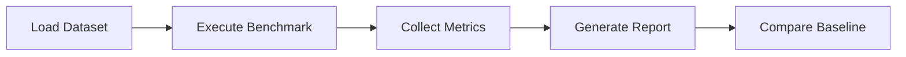

# 02. Performance Benchmark

**Project:** TROVIX  
**Module:** Performance Evaluation  
**Version:** 1.0  
**Author:** Pari (Indexing Lead)

---

# Table of Contents

1. Introduction
2. Benchmarking Objectives
3. Performance Metrics
4. Benchmark Architecture
5. Indexing Benchmarks
6. Query Benchmarks
7. Memory Benchmarks
8. Scalability Benchmarks
9. Benchmark Dataset
10. Success Criteria
11. Future Improvements
12. Conclusion

---

# Introduction

A search engine must not only return correct results but also return them quickly.

As the number of indexed documents grows, inefficient algorithms can significantly increase indexing time, query latency, and memory consumption.

Performance benchmarking provides a structured framework for evaluating the efficiency of every major subsystem within TROVIX.

Unlike functional testing, which verifies correctness, benchmarking measures speed, scalability, and resource utilization.

The objective is to ensure that TROVIX continues to satisfy its performance goals as the system evolves.

---

# Why Benchmark?

Performance degradation often occurs gradually.

A new feature may appear correct while silently increasing

- query latency,
- indexing time,
- memory consumption,
- CPU utilization.

Without benchmarking,

these regressions remain difficult to detect.

Benchmarking allows developers to compare performance across different versions of TROVIX and verify that optimizations produce measurable improvements.

---

# Benchmarking Objectives

The benchmarking strategy focuses on four primary goals.

## Measure Speed

Evaluate how quickly the search engine performs indexing and retrieval.

---

## Measure Scalability

Determine how performance changes as the corpus size increases.

---

## Measure Resource Usage

Track memory and CPU utilization during indexing and searching.

---

## Detect Performance Regressions

Identify algorithmic changes that negatively affect execution time or resource consumption.

---

# Performance Metrics

The following metrics are used throughout the benchmark suite.

| Metric | Description |
|----------|-------------|
| Index Build Time | Time required to construct the inverted index |
| Query Latency | Time required to execute a search query |
| Vocabulary Size | Number of indexed terms |
| Posting List Size | Number of postings generated |
| Memory Usage | Peak RAM consumption |
| CPU Utilization | Average processor usage |
| Throughput | Queries processed per second |

These metrics provide a comprehensive view of search engine performance.

---

# Benchmark Architecture

Every benchmark follows the same execution workflow.



Benchmark execution should remain deterministic and reproducible.

---

# Summary

Performance benchmarking provides quantitative evidence that TROVIX satisfies its latency, scalability, and efficiency requirements.

The following sections evaluate each subsystem independently before measuring complete end-to-end search performance.

---

# Indexing Benchmarks

The indexing subsystem is responsible for constructing the inverted index from a collection of raw documents.

Since indexing is performed offline, throughput is generally more important than individual document latency.

The objective is to maximize indexing speed while maintaining correctness and reasonable memory consumption.

---

# Index Build Time

Index Build Time measures the total time required to construct the complete inverted index.

Workflow

```text
Load Dataset

↓

Parse Documents

↓

Tokenize Documents

↓

Build Vocabulary

↓

Generate Posting Lists

↓

Complete Index
```

The benchmark begins when the first document is processed and ends when the final posting list has been created.

Metric

```
Seconds
```

Target

| Dataset Size | Target |
|---------------|---------|
| 1,000 Documents | < 2 seconds |
| 10,000 Documents | < 10 seconds |
| 50,000 Documents | < 60 seconds |

---

# Index Throughput

Throughput measures how many documents are indexed every second.

Formula

```text
Indexed Documents

------------------------

Elapsed Time
```

Example

```
50,000 Documents

↓

40 Seconds
```

Throughput

```
1250 Documents / Second
```

Higher throughput indicates a more efficient indexing pipeline.

---

# Vocabulary Growth

Vocabulary size measures the number of unique normalized terms stored inside the inverted index.

Example

```
machine

learning

python

database
```

Vocabulary Size

```
4
```

The benchmark verifies that vocabulary growth remains proportional to corpus diversity rather than total document count.

Metrics collected

- Total unique terms
- Average new terms per document
- Duplicate term ratio

---

# Posting List Generation

Posting list generation is one of the most important indexing operations.

Metrics

- Total posting lists created
- Average posting list length
- Largest posting list
- Total postings generated

These statistics help identify extremely common terms that may require optimization.

---

# Query Benchmarks

Query benchmarks evaluate runtime search performance.

Unlike indexing,

query execution must satisfy strict latency requirements.

Every search should complete within milliseconds.

---

# Query Latency

Latency measures the total time required to execute one search request.

Workflow

```text
Receive Query

↓

Tokenize

↓

Retrieve Candidates

↓

BM25 Ranking

↓

Sort Results

↓

Return Response
```

Metric

```
Milliseconds
```

Version 1 Target

```
< 10 ms
```

Average,

median,

and worst-case latency should all be recorded.

---

# Query Throughput

Throughput measures the number of search requests processed every second.

Formula

```text
Completed Queries

----------------------

Elapsed Time
```

Example

```
500 Queries

↓

5 Seconds
```

Throughput

```
100 Queries / Second
```

Future optimizations should increase throughput without sacrificing ranking quality.

---

# BM25 Performance

Ranking is one of the most computationally intensive stages of query execution.

Benchmark metrics

- Candidate documents scored
- Average BM25 computation time
- Maximum ranking time
- Average ranking time per document

These measurements help identify bottlenecks within the ranking engine.

---

# Memory Benchmarks

Efficient memory usage is essential for scalable search systems.

The benchmark suite measures memory consumption during both indexing and querying.

---

# Index Memory Usage

Measure the total RAM required by

- Vocabulary
- Posting Lists
- Document Statistics
- Corpus Statistics

Metric

```
Megabytes (MB)
```

The benchmark should identify which data structure consumes the greatest proportion of available memory.

---

# Peak Memory Usage

Peak memory represents the highest RAM consumption observed during indexing.

Workflow

```text
Start Indexing

↓

Allocate Structures

↓

Build Index

↓

Peak Memory Recorded

↓

Finish
```

The goal is to minimize unnecessary temporary allocations.

---

# Query Memory Usage

During query execution,

temporary structures include

- Query Tokens
- Candidate Set
- Score Dictionary
- Search Response

These structures should remain lightweight regardless of corpus size.

---

# Scalability Benchmarks

Scalability testing measures how performance changes as the dataset grows.

Rather than evaluating a single dataset,

multiple corpus sizes are benchmarked.

---

# Dataset Scaling

Recommended benchmark sizes

| Documents | Purpose |
|-----------:|---------|
| 100 | Functional Verification |
| 1,000 | Small Dataset |
| 10,000 | Medium Dataset |
| 50,000 | Version 1 Target |
| 100,000 | Stress Testing |
| 500,000 | Future Benchmark |

Performance should increase approximately linearly as corpus size grows.

---

# Query Scaling

Different query lengths should also be evaluated.

Examples

| Query | Tokens |
|--------|-------:|
| `python` | 1 |
| `machine learning` | 2 |
| `deep learning neural networks` | 4 |
| Long Natural Language Query | 10+ |

The benchmark should verify that latency increases gradually as query complexity increases.

---

# Benchmark Dataset

Performance testing requires datasets that resemble real-world document collections.

Recommended characteristics

- Mixed document lengths
- Diverse vocabulary
- Technical articles
- Documentation
- Tutorials
- Repeated keywords
- Rare keywords

Synthetic datasets should be avoided whenever realistic data is available.

---

# Benchmark Reporting

Every benchmark execution should generate a structured report.

Example

```text
Benchmark Report

Dataset Size:
50,000 Documents

Index Build Time:
41.2 Seconds

Vocabulary Size:
183,412

Posting Lists:
183,412

Total Postings:
5,238,911

Average Query Latency:
6.4 ms

Peak Memory:
412 MB
```

Reports should be stored to allow comparison between project versions.

---

# Success Criteria

A benchmark run is considered successful when the following conditions are satisfied.

| Metric | Target |
|---------|--------|
| Index Build Time | Within Target |
| Query Latency | < 10 ms |
| Query Throughput | Meets Expected Rate |
| Memory Usage | Stable |
| Linear Scalability | Verified |
| No Performance Regression | Verified |

Only benchmark results meeting these criteria should be accepted as production-ready.

---

# Design Principles

The TROVIX benchmarking strategy follows several engineering principles.

- Measure objectively using quantitative metrics.
- Benchmark under reproducible conditions.
- Compare against previous versions.
- Benchmark both correctness and efficiency.
- Monitor memory as well as execution time.
- Evaluate scalability using progressively larger datasets.

These principles ensure that optimization efforts are driven by measurable improvements rather than assumptions.

---

# Future Improvements

Future benchmarking capabilities may include

- Distributed indexing benchmarks
- Multi-threaded query execution
- Concurrent user simulation
- GPU-accelerated ranking evaluation
- Persistent index loading benchmarks
- Hybrid BM25 + Vector Search performance comparisons
- Cloud deployment benchmarks
- Energy consumption measurements

These additions will allow TROVIX to evolve from a single-machine search engine into a production-scale retrieval platform.

---

# References

## Books

- *Introduction to Information Retrieval* — Manning, Raghavan & Schütze
- *Managing Gigabytes* — Witten, Moffat & Bell

---

## Documentation

- Apache Lucene Benchmark Module
- Elasticsearch Rally Documentation
- Python `timeit` Documentation
- Python `cProfile` Documentation

---

# Conclusion

Performance benchmarking provides measurable evidence that TROVIX satisfies its efficiency goals.

By evaluating indexing throughput, query latency, memory consumption, scalability, and resource utilization, the benchmarking framework ensures that every optimization can be verified using objective data rather than subjective observation.

As TROVIX grows in complexity and dataset size, these benchmarks will serve as the primary mechanism for detecting regressions, validating improvements, and guiding future optimization efforts.

---

# Key Takeaways

The TROVIX Performance Benchmark framework ensures that:

- Index construction remains efficient as datasets grow.
- Query execution satisfies strict latency requirements.
- Memory consumption remains predictable.
- Scalability is continuously monitored.
- Performance regressions are detected early.
- Optimizations are supported by measurable evidence.

Together with the Testing Strategy, this benchmarking framework establishes a comprehensive quality assurance process that validates both the correctness and efficiency of the TROVIX search engine.

