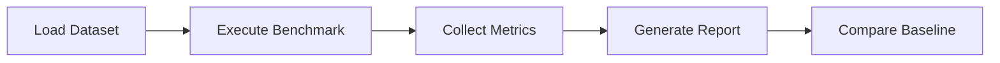

# 02. Performance Benchmark

**Project:** TROVIX  
**Module:** Performance Evaluation  
**Version:** 1.0  
**Author:** Pari (Indexing Lead)

---

# Table of Contents

1. Introduction
2. Benchmarking Objectives
3. Performance Metrics
4. Benchmark Architecture
5. Indexing Benchmarks
6. Query Benchmarks
7. Memory Benchmarks
8. Scalability Benchmarks
9. Benchmark Dataset
10. Success Criteria
11. Future Improvements
12. Conclusion

---

# Introduction

A search engine must not only return correct results but also return them quickly.

As the number of indexed documents grows, inefficient algorithms can significantly increase indexing time, query latency, and memory consumption.

Performance benchmarking provides a structured framework for evaluating the efficiency of every major subsystem within TROVIX.

Unlike functional testing, which verifies correctness, benchmarking measures speed, scalability, and resource utilization.

The objective is to ensure that TROVIX continues to satisfy its performance goals as the system evolves.

---

# Why Benchmark?

Performance degradation often occurs gradually.

A new feature may appear correct while silently increasing

- query latency,
- indexing time,
- memory consumption,
- CPU utilization.

Without benchmarking,

these regressions remain difficult to detect.

Benchmarking allows developers to compare performance across different versions of TROVIX and verify that optimizations produce measurable improvements.

---

# Benchmarking Objectives

The benchmarking strategy focuses on four primary goals.

## Measure Speed

Evaluate how quickly the search engine performs indexing and retrieval.

---

## Measure Scalability

Determine how performance changes as the corpus size increases.

---

## Measure Resource Usage

Track memory and CPU utilization during indexing and searching.

---

## Detect Performance Regressions

Identify algorithmic changes that negatively affect execution time or resource consumption.

---

# Performance Metrics

The following metrics are used throughout the benchmark suite.

| Metric | Description |
|----------|-------------|
| Index Build Time | Time required to construct the inverted index |
| Query Latency | Time required to execute a search query |
| Vocabulary Size | Number of indexed terms |
| Posting List Size | Number of postings generated |
| Memory Usage | Peak RAM consumption |
| CPU Utilization | Average processor usage |
| Throughput | Queries processed per second |

These metrics provide a comprehensive view of search engine performance.

---

# Benchmark Architecture

Every benchmark follows the same execution workflow.

Benchmark execution should remain deterministic and reproducible.

---

# Summary

Performance benchmarking provides quantitative evidence that TROVIX satisfies its latency, scalability, and efficiency requirements.

The following sections evaluate each subsystem independently before measuring complete end-to-end search performance.